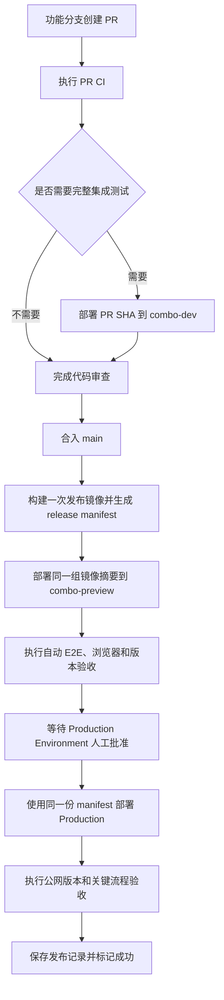

# Test、Preview 与 Production 同源晋升方案

- 状态：提议中，尚未批准实施。
- 跟踪 Issue：[发布链路同源化与前端版本验证 #112](https://github.com/dangdang-tech/Combo/issues/112)。
- 背景 PR：[修复 Studio UI 编辑与保存状态体验 #111](https://github.com/dangdang-tech/Combo/pull/111)。
- 适用范围：Combo 的 PR 验证、共享测试、发布候选验收和生产部署。

## 结论

Combo 应保留三个职责不同的运行环境。`combo-dev` 用于合并前的共享集成测试，`combo-preview` 用于合并后的发布候选验收，Production 只接收已经在 Preview 验收通过的同一组镜像摘要。

Preview 是部署环境，不是长期代码分支。后续发布流程应由 `main` 中的工作流管理，并以完整提交 SHA 和镜像摘要建立唯一的发布记录。

生产发布初期采用“人工批准、机器执行”。Preview 的自动验收通过后，GitHub Actions 等待 Production Environment 的批准；负责人确认候选版本后，流水线自动部署、执行公网验收，并在失败时恢复上一组应用镜像。

## 当前状态

当前仓库存在两条互不闭合的发布路径。

第一条路径由 `main` 管理。PR 只执行 CI 和镜像构建，合入 `main` 后 CI 推送 SHA 标签，随后 `.github/workflows/cd.yml` 直接部署 Production。

第二条路径由长期分支 `codex/agent-studio-cloud-preview` 管理。该分支拥有独立的 Cloud Review 工作流和完整 Creation Shell 变更，并部署到固定的 `combo-preview` 槽位。它没有通过整合 PR 持续同步 `main`，也没有把验收结果晋升为 Production 使用的同一组产物。

现有 Cloud Review 基础设施可以继续使用，但还存在以下发布缺口。

| 缺口                                                                | 当前影响                                             |
| ------------------------------------------------------------------- | ---------------------------------------------------- |
| Cloud Review 工作流不由 `main` 管理。                               | Preview 的部署规则可能与主线长期分叉。               |
| `main` CI 成功后直接触发 Production CD。                            | Production 前没有正式的发布候选门禁。                |
| Preview 与 Production 分别构建 Web 镜像。                           | 用户验收的前端产物不一定等于生产产物。               |
| 部署主要使用 SHA 标签，而不是不可变镜像摘要。                       | 发布记录不能完整证明实际拉取的镜像内容。             |
| GitHub `cloud-review` Environment 尚未配置保护规则。                | 固定槽位可以在没有正式批准的情况下被覆盖。           |
| Production 没有可公开验证的版本契约。                               | 公网页面无法证明自己运行的提交和镜像版本。           |
| 现有 Production smoke 不验证公网版本、关键 SPA 路由和静态资源契约。 | CI/CD 全绿仍可能遗漏错误页面、旧 bundle 或错误缓存。 |

## 环境职责

| 环境            | 主要用途                                                          | 部署来源                                  | 数据策略                                 | 发布凭证                                    |
| --------------- | ----------------------------------------------------------------- | ----------------------------------------- | ---------------------------------------- | ------------------------------------------- |
| CI 临时依赖     | 验证 lint、类型、测试、构建和基础迁移。                           | 每个 PR 的提交。                          | Job 结束后销毁。                         | CI 检查结果。                               |
| `combo-dev`     | 验证需要真实 API、Worker、Runtime、对象存储和浏览器的合并前改动。 | 人工选择的 PR SHA。                       | 使用独立持久数据，允许频繁覆盖。         | 仅作为开发验证证据。                        |
| `combo-preview` | 验证已合入 `main` 的正式发布候选。                                | `main` 的完整 SHA 和 release manifest。   | 使用独立持久数据，验收期间锁定候选版本。 | 自动验收、人工批准、SHA 和镜像摘要。        |
| Production      | 对外提供正式服务。                                                | Preview 已批准的同一份 release manifest。 | 使用生产数据和生产 Secret。              | Production Deployment、版本接口和公网验收。 |

普通 PR 不必自动占用共享 `combo-dev`。CI 对所有 PR 强制执行，只有涉及完整业务链路、数据库迁移、Runtime、对象存储或部署边界的 PR 才部署到 `combo-dev`。

## 目标流程



合入 `main` 不再等于立即发布 Production。它表示代码已经进入主线并成为待验证的发布候选。Preview 失败时，Production 保持上一版本，团队通过新的 PR 修复或回退主线提交。

## 发布产物

`main` CI 应在一次构建中产生 API、Runtime 和 Web 镜像，并解析仓库实际返回的镜像摘要。流水线随后生成一份不包含 Secret 的 release manifest。

```json
{
  "sourceSha": "<完整 main SHA>",
  "images": {
    "api": "ghcr.io/dangdang-tech/combo-api@sha256:<digest>",
    "runtime": "ghcr.io/dangdang-tech/combo-runtime@sha256:<digest>",
    "web": "ghcr.io/dangdang-tech/combo-web@sha256:<digest>"
  },
  "migrationHead": "<迁移版本>",
  "builtAt": "<UTC 时间>"
}
```

SHA 标签可继续保留，便于人工查找和兼容现有回滚入口，但 Preview 与 Production 的部署清单必须使用 `image@sha256:digest`。生产部署不得再次执行 Docker build。

release manifest 应同时保存为 GitHub Actions 产物和 Deployment 元数据。后续审批、部署、验收和回滚都引用同一份 manifest，而不是根据 `latest` 或可移动标签重新推断版本。

## 前端运行时配置

当前 Preview Web 在构建时注入 `VITE_DEPLOY_ENV=preview`、构建 SHA 和来源分支，因此 Preview 与 Production 的 Web 镜像内容不同。这与“同一产物晋升”的目标冲突。

Web 镜像应改为环境无关构建。部署时由 Nginx 或应用入口提供受控的运行时配置，例如 `/runtime-config.json`。

```json
{
  "environment": "preview",
  "sourceSha": "<完整 main SHA>",
  "releaseId": "<发布记录 ID>"
}
```

Preview 使用该配置展示预览标识和版本信息，Production 使用同一镜像但注入 `environment=production`。访问闸、域名、API 地址和 Secret 继续由环境清单与运行时配置决定，不进入前端 bundle。

## GitHub Actions 门禁

目标发布流水线由 `main` 管理，并保持一个固定发布并发组。前一个候选仍在 Preview 验收或等待 Production 批准时，后续候选排队，不能覆盖用户正在验收的固定槽位。

```text
build-release
  deploy-preview
  verify-preview
  approve-production
  deploy-production
  verify-production
```

`approve-production` 对应 GitHub `production` Environment。初始阶段必须配置 required reviewers，并限制只有 `main` 的候选版本可以进入。批准动作只放行已经完成自动验收的确定 release manifest。

Preview 入口应写入 GitHub Deployment 的 `environment_url`。Deployment 记录至少包含环境、完整提交 SHA、release ID 和镜像摘要引用。

当自动验收、回滚和生产可观测性稳定后，可以另行决策是否取消人工批准。本方案不默认开启完全无人值守的生产发布。

## Preview 验收

Preview 门禁至少包含以下检查。

- 页面明确展示环境、完整提交 SHA、release ID 和构建时间。
- 匿名访问和 Review Cookie 访问闸符合预期。
- `dev-login`、`/me`、登出失效和受保护路由正常。
- Creation Shell、上传、提取、编辑、异步恢复、Agent 结果和 Studio 入口完成代表性验收。
- API、Worker、Runtime、SSE 和对象存储完成一条真实端到端链路。
- 数据库迁移先于应用 rollout，并且重复部署保持幂等。
- 页面、API 和运行时报告同一个 release ID。
- 关键路由返回预期 SPA，而不是通用 fallback 或旧入口。
- 缺失的 hashed asset 返回 404，不能返回 `200 text/html`。

Preview 验收成功只批准当前 release manifest。任何新候选进入后，之前尚未完成的验收自动失效。

## Production 部署与验收

Production Job 读取已批准的 release manifest，先记录当前生产摘要，再按经过审核的顺序执行迁移和应用 rollout。

生产验收至少包含以下检查。

- 公网 `/version.json` 或 `X-Combo-Revision` 返回本次 source SHA、release ID、构建时间和 Web asset manifest 标识。
- `https://buildwithcombo.com/`、`/tasks`、`/capabilities` 和关键 Creation 路由返回正确页面。
- 公网 API readiness、Runtime readiness 和必要的只读业务探针通过。
- 页面报告的 release ID 与 GitHub Deployment 记录一致。
- HTML 使用重新验证缓存策略，带内容摘要的静态资源使用长期 immutable 缓存策略。
- 人为指定错误 SHA、错误 digest、缺失资源或错误公网路由时，部署必须失败。

Production 验收失败时，流水线恢复上一份成功 release manifest 中的应用镜像，并把发布标记为失败。数据库结构不能依赖简单回滚，因此迁移必须采用向后兼容的扩展和收缩流程。

## 数据库迁移约束

Preview 使用独立数据库，不能完全模拟生产数据规模和历史状态。Production 部署仍需执行生产专属的迁移前置检查。

迁移应先增加兼容结构，再切换应用读写，最后在独立发布中清理旧结构。应用回滚期间，新旧版本都必须能够使用当前数据库结构。破坏性迁移需要单独审批、备份和恢复演练，不能依赖应用镜像回滚覆盖风险。

## Secret 与权限

- `combo-dev`、`combo-preview` 和 Production 继续使用独立 Secret，不复制整份生产配置。
- Build Job 只需要读取源码和推送镜像，不持有集群部署凭据。
- Preview Deploy Job 只能操作 `combo-preview`。
- Production Deploy Job 只能在 Production Environment 批准后取得生产部署凭据。
- release manifest 不包含访问 token、Cookie、API Key、SSH Key 或 Kubernetes Secret 数据。
- 工作流日志不得输出 Secret、Authorization Header 或 Secret 解码结果。

## 分阶段落地

### 第一阶段：收敛事实源

- 将 Cloud Review workflow、overlay、部署脚本和必要的 Preview 页面能力通过正式 PR 整合到最新 `main`。
- 现有长期 Preview 分支进入冻结状态，不再承接新功能开发。
- 给 GitHub `cloud-review` Environment 配置保护规则和明确的环境 URL。

### 第二阶段：建立 Preview 门禁

- 将 `main` CI 后的直接 Production CD 改为先部署 `combo-preview`。
- 生成 release manifest，并让 K3s 清单按镜像摘要部署。
- 增加完整 Preview E2E、版本展示和候选锁。

### 第三阶段：建立受控生产晋升

- 创建受保护的 GitHub `production` Environment。
- 由人工批准放行同一份 release manifest。
- 增加 Production `/version.json`、公网路由、静态资源和缓存验收。
- 保存上一份成功 manifest，并完成应用镜像恢复演练。

### 第四阶段：评估自动化程度

- 根据连续发布成功率、平均恢复时间和误报率评估是否取消人工批准。
- 若资源和团队规模确有需要，再评估每个 PR 的临时 Preview；固定单槽在当前阶段仍可满足需求。

## 与 combo-dev 的关系

正在建设的 `combo-dev` 解决共享开发环境缺失的问题。本方案不要求把 `combo-dev` 改造成发布候选环境，也不把 Preview 的公网访问、审批和生产晋升职责放入当前 combo-dev PR。

当前 combo-dev 工作流完成后，再按照 Issue #112 的诊断、批准和隔离 PR 流程实施本方案。两个任务可以复用 Kustomize、镜像摘要和验收脚本的通用能力，但必须保持 namespace、Secret、访问方式和发布权限独立。

## 非目标

- 本方案不要求当前阶段为每个 PR 创建独立 K3s namespace。
- 本方案不在 proposal PR 中修改 CI、CD、应用代码、集群资源或 GitHub Environment。
- 本方案不直接合并长期 Preview 分支，也不批量合并无关开放 PR。
- 本方案不默认启用完全无人审批的生产发布。
- 本方案不把 Production Secret 或数据复制到测试环境。

## 验收标准

- Preview 工作流和部署脚本由 `main` 管理，不再依赖长期分叉分支。
- 一个 `main` SHA 只生成一组正式发布镜像摘要和一份 release manifest。
- Preview 与 Production 的 API、Runtime 和 Web 工作负载使用同一组镜像摘要。
- Preview 在验收期间不会被另一个候选版本覆盖。
- Production 必须等待 Preview 自动验收和人工批准。
- 公网页面可以证明当前 source SHA、release ID 和部署记录。
- 错误 SHA、错误 digest、缺失 asset、错误路由和公网不可达都会阻断发布。
- Preview 或 Production 失败时，流水线不会把失败候选标记为成功。
