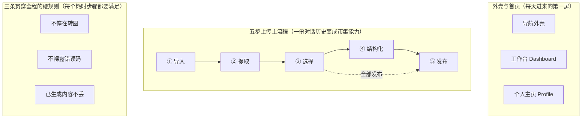

# Agora 创作者中心 · 主链路测试验收文档

> 本文是创作者中心主链路（导入、提取、选择、结构化、发布五步）的测试验收清单，给测试同学按页验收用。
>
> 重点是平台功能测试——验证用户能看到的页面行为、状态、文案、交互，不下到代码级。后端接口测试待接口定稿后补充，本文先留出结构。
>
> 对应文档：飞书《Agora · 创作者中心 PRD》、《Agora 创作者中心主链路技术方案》。

---

## 〇、测试说明

### 0.1 测什么、不测什么

| 本文覆盖 | 本文不覆盖 |
|---|---|
| 创作者中心的导航外壳、工作台、个人主页 | 消费端的市集、社区发现、能力详情页 |
| 五步上传主流程：导入、提取、选择、结构化、发布 | 试用 Trial 运行态（设计未定稿，等定稿后单独出验收） |
| 草稿、断点续传、加载与异常状态 | 计费、分成、收益结算的具体算法 |
| 用户能看到的页面行为与文案口径 | 函数级、接口级、数据库级的代码测试 |

### 0.2 怎么测、优先级、怎么算通过

测法是黑盒功能验收：照着每条用例的操作步骤走一遍，对预期结果判断过还是不过。预期结果都写成可观察、可判定的样子，照着就能下结论。

| 优先级 | 含义 | 验收要求 |
|---|---|---|
| P0 | 核心主流程，挡住就没法用 | 必须全部通过才允许上线 |
| P1 | 重要功能，缺了体验明显受损 | 允许少量挂起，但要有结论和修复计划 |
| P2 | 体验细节与边缘场景 | 记录在案，可排期修 |

放行标准：P0 用例零失败；P1 失败项有明确处理结论；剩余缺陷按第四章分级登记。

### 0.3 测试范围地图（图1）

【此处嵌入图1 · 测试范围地图】

### 0.4 三条贯穿全程的硬规则

这三条不是某一步独有，而是每个耗时步骤都要额外过一遍。测每一个加载、超时、失败、中断场景时，都拿这三条对一遍。

1. **永远不停在转圈。** 等待一律用进度条、子任务清单、边生成边显示来表达，不能只放一个空转的圈。
2. **绝不裸露错误码。** 失败要落到说人话的错误态，给重试、改输入、转人工这类退路，不能把 500、堆栈、英文报错直接甩给用户。
3. **已生成的内容不会丢。** 中断、超时、失败、刷新之后，已经做好的部分都还在，不用从头再来。

---

## 一、平台功能测试

### 1.1 导航外壳与工作台 Dashboard

这个模块是创作者登录后的整个外壳框架（左侧栏、顶部面包屑、主内容区）加上默认首页工作台。工作台是只有创作者自己能看的经营后台，回答"我的能力体经营得怎么样"，展示经营摘要、四张核心指标卡、token 消耗趋势、能力体列表、未完成的草稿条。测它是因为：它是创作者每天进来的第一屏，外壳要在五步上传流程里始终稳定不变，钱和成本数据绝不能跑到对外页面，断点续传入口要真能把人带回中断的那一步。

| 用例编号 | 测试点 | 操作步骤 | 预期结果 | 优先级 |
|---|---|---|---|---|
| 外壳首页-01 | 登录后默认落在工作台首页 | 创作者用自己的账号完成登录，不点任何菜单，观察落地页面。 | 登录完成后直接停在工作台页面，页头标题显示'创作者中心'，能看到经营摘要、核心指标卡、token 趋势、能力体列表这几个区块，不是停在登录页也不是别的页面。 | P0 |
| 外壳首页-02 | 外壳三段式结构齐全 | 进入工作台后，整屏从左到右、从上到下看一遍外壳框架。 | 左边有一条固定侧栏，顶部是顶栏面包屑，中间是主内容区，三者同时存在；侧栏顶部能看到 Agora 品牌字标和收起/展开开关，侧栏底部能看到当前账号区（头像、姓名、职位，例如 Wayne·CGO）。 | P0 |
| 外壳首页-03 | 侧栏导航分两组且菜单项齐全 | 在侧栏里逐项核对导航分组和菜单名称。 | 侧栏分两组：创作组里能看到工作台、我的能力、上传能力、数据分析、收益五项；我的组里能看到个人主页一项；项数和名称都对得上，没有多出来或缺失的项。 | P0 |
| 外壳首页-04 | 侧栏收起成纯图标态再展开 | 点侧栏顶部的收起开关，观察侧栏；再点一次展开开关，观察侧栏。 | 点收起后侧栏变窄、菜单只剩图标、文字隐藏，主内容区相应变宽；再点展开后侧栏恢复成图标加文字的样子，宽度复原；收起和展开过程中没有页面跳走或内容丢失。 | P1 |
| 外壳首页-05 | 侧栏收起态下菜单仍可点且可识别 | 把侧栏收起成纯图标态，把鼠标移到某个图标上，再点其中一项（如'我的能力'）。 | 鼠标移到图标上能看到该项的名称提示，点了之后能正常进入对应页面；不会因为文字隐藏就点不动或认不出是哪一项。 | P2 |
| 外壳首页-06 | 顶栏面包屑反映当前所在位置 | 从工作台点进侧栏的'上传能力'进入上传流程，再看顶栏面包屑文字。 | 顶栏面包屑显示当前所处层级，例如'上传能力 / Creator Builder'，能看出自己正在哪个区域的哪个页面；顶栏右上角始终有账号头像。 | P1 |
| 外壳首页-07 | 五步上传流程任一步都不改变外壳结构 | 进入五步上传流程，依次走到第一步、第二步、第三步、第四步、第五步，每一步都看左侧栏和顶栏是否还在、位置和样式是否变化。 | 从第一步到第五步，左侧栏（含品牌字标、两组导航、底部账号区）和顶栏（面包屑加头像）始终在原位、样式不变，只有中间主内容区在换；外壳不会某一步突然消失、错位或换布局。 | P0 |
| 外壳首页-08 | 工作台页头摘要展示真实经营概览 | 在工作台页头区域查看标题和那句经营摘要。 | 标题显示'创作者中心'，下面一句话摘要把已发布能力体数量和本月被调用次数说清楚，例如'你发布的 8 个能力体，本月被调用 12,400 次'；句中的数字与下方指标卡里对应的数字一致，不是写死的占位文案。 | P0 |
| 外壳首页-09 | 核心指标带四张大数字卡齐全且带环比 | 查看页头下方的核心指标带，逐张核对四张卡片。 | 横向排着四张大数字卡：已发布能力体、累计调用、本月消耗、活跃消费者，每张都显示一个大数字，并各自带一个环比变化（涨或跌的幅度），四张缺一不可。 | P0 |
| 外壳首页-10 | token 消耗趋势图按口径可切换 | 查看每日 token 消耗趋势图，先看默认口径，再点切到另一个口径。 | 趋势图是折线加面积的样子，图上把峰值标了出来；上方有 tokens 和调用次数两个口径开关，点切换后曲线随之换成对应口径的数据，纵轴含义也跟着变，切换不报错。 | P1 |
| 外壳首页-11 | 能力体列表表格列项齐全 | 查看'我的能力体'列表表格，逐列核对表头与某一行的内容。 | 表格每行能看到：名称带一句话简介、状态、本月调用、消耗趋势迷你图、收益、操作（含试用、编辑、更多）；表格右上角常驻一个'+ 上传新能力'主按钮。 | P0 |
| 外壳首页-12 | 点'+ 上传新能力'进入五步上传流程 | 在工作台能力体列表右上角点'+ 上传新能力'按钮，观察跳转结果。 | 点完进入五步上传流程的第一步，面包屑显示进入了上传/Creator Builder 区域；进入的是从头开始的新上传，不是某个旧草稿。 | P0 |
| 外壳首页-13 | 侧栏'上传能力'与'+ 上传新能力'入口等价 | 先记住点'+ 上传新能力'进入的页面，再退回工作台，点侧栏'上传能力'进入，比较两者落点。 | 两个入口都进入同一个五步上传流程的第一步，落地页面、步骤、外壳完全一致；不存在一个能进一个进不去，或进到不同界面的情况。 | P1 |
| 外壳首页-14 | 能力体行内'试用'进入该能力的试用运行态 | 在能力体列表里某一行点'试用'，观察进入的页面。 | 进入的是这一行对应能力的试用运行态界面，而不是别的能力，也不是编辑页；页面里能看出是哪一个能力在被试用。 | P1 |
| 外壳首页-15 | 能力体行内'编辑'进入草稿修改 | 在能力体列表里某一行点'编辑'，观察进入的页面。 | 进入的是这一行对应能力的编辑/草稿修改界面，能看到并改动这个能力的内容；不会跑到试用页或新建上传。 | P1 |
| 外壳首页-16 | 草稿与上传中条展示未完成任务及所处步骤 | 先制造一个未完成的上传任务（开始上传后在中途某一步停下离开），回到工作台查看草稿与上传中条。 | 工作台上出现一条横向胶囊条，里面列出这个未完成的上传任务，并标明它停在第几步（例如停在第二步提取）；条上有'去上传流程'可点。 | P0 |
| 外壳首页-17 | 草稿条一键回到中断的那一步 | 在工作台草稿条上点某条未完成任务的'去上传流程'，观察落地的步骤。 | 直接回到该任务当初中断的那一步（之前停在第几步就回到第几步），之前已填/已生成的内容还在，不是从头第一步重来。 | P0 |
| 外壳首页-18 | 上传流程任意一步中断后都能从工作台续传 | 分别在上传流程第一步、第三步、第五步各制造一次中断（停下离开回到工作台），每次都从草稿条点回去。 | 三次都能从工作台草稿条回到各自中断的那一步，停在第几步就回到第几步；不会出现某一步中断后草稿条里找不到、或回去后步骤对不上的情况。 | P1 |
| 外壳首页-19 | 全页时间范围切换三档生效 | 在工作台找到时间范围切换，依次点'近 7 天''近 30 天''全部'，每切一次观察四张指标卡、趋势图、能力体列表的数据。 | 每切换一档，指标卡数字、趋势图的时间跨度与曲线、能力体列表里的本月调用与收益都跟着换成对应区间的数据；当前选中的是哪一档有明显标识，三档都能点、都能出数。 | P1 |
| 外壳首页-20 | 工作台只对创作者本人可见且含经营数据 | 以创作者本人身份打开工作台，确认能看到本月消耗、收益、token 趋势、草稿续传、上传入口；再设法以非本人视角（如他人访问该创作者）查看。 | 创作者本人能在工作台看到钱（本月消耗、收益）、成本（token 趋势）、经营动作（草稿续传、上传入口、能力管理）；非本人无法进入这个工作台、看不到这些经营数据。 | P0 |
| 外壳首页-21 | 钱与成本数据不外泄到对外页面 | 从工作台切到个人主页（对外名片），逐项查找本月消耗、收益、token 消耗趋势、草稿条、上传入口。 | 个人主页上找不到本月消耗、收益、token 趋势、草稿续传、上传入口这些经营和钱的内容；这些只出现在工作台，没有泄漏到对外页面。 | P0 |
| 外壳首页-22 | 首次使用、还没有任何能力体时的空态 | 用一个尚未发布任何能力、也没有任何调用数据的新创作者账号打开工作台。 | 页面正常展示，不报错也不空白一片；能力体列表显示友好的空状态并引导去'+ 上传新能力'，指标卡显示 0 或'暂无数据'而不是乱码或破图，经营摘要用得体的文案表达还没有数据。 | P1 |
| 外壳首页-23 | 没有未完成任务时草稿条的状态 | 用一个没有任何未完成上传任务的账号打开工作台，查看草稿与上传中条所在位置。 | 草稿条要么不显示，要么显示'暂无未完成的上传'之类的明确空态，不会出现一条空白胶囊或残留的旧任务条。 | P2 |
| 外壳首页-24 | 经营数据正在聚合时不停在转圈 | 在工作台数据需要从后台聚合、加载较慢的情况下打开页面，观察指标卡、趋势图、能力体列表的加载表现。 | 加载期间显示占位的灰色加载条等明确的加载提示，数据到了就替换上真实内容；不会一直停在转圈、也不会长时间空白没有任何反馈。 | P0 |
| 外壳首页-25 | 经营数据拉取失败时落到带退路的错误态 | 在工作台数据拉取失败的情况下打开页面（例如后台聚合查询取不到数据），观察页面反应。 | 页面给出一句看得懂的错误说明并提供'重试'之类的退路，不会甩出一串错误码或英文报错原文；点重试能重新拉取，外壳和其他能正常显示的区块仍在。 | P0 |
| 外壳首页-26 | 趋势图所在区间内无任何消耗时的表现 | 把时间范围切到一个该创作者完全没有 token 消耗的区间，查看趋势图。 | 趋势图显示该区间'暂无消耗'的空态或一条贴零的曲线，并明确说明这段时间没有数据；不会显示破图、报错，也不会误标出不存在的峰值。 | P2 |
| 外壳首页-27 | 刷新工作台不会重复触发任何写操作 | 在工作台页面按浏览器刷新若干次，再观察能力体数量、草稿条里的任务条数和指标数据。 | 刷新只是重新读取并展示数据，能力体不会平白多出一个、草稿任务不会被复制成多条、也不会触发任何发布或上传动作；刷新前后的内容保持一致。 | P1 |
| 外壳首页-28 | 当前所在页在侧栏有选中高亮 | 依次进入工作台、我的能力、数据分析等页面，每到一处看侧栏对应菜单项的状态。 | 当前所在的页面在侧栏里有明显的选中高亮，和其他未选中项区分得开；换页后高亮跟着移到新的当前项，不会出现两项同时高亮或没有任何高亮。 | P2 |
| 外壳首页-29 | 大数字与环比的展示精确可读 | 对照后台真实数据，核对四张指标卡的大数字和环比方向、幅度。 | 卡片上的数字与真实数据一致，千分位等格式清晰可读；环比涨用向上、跌用向下表示且幅度正确，不会把涨标成跌或方向画反。 | P2 |
| 外壳首页-30 | 中断续传过程中已生成内容不丢 | 在上传流程某一步已经生成了内容（例如已提取出候选或已生成部分说明书字段）后中断离开，回到工作台再从草稿条点回该步。 | 回到中断那一步后，之前已经生成的候选或字段内容原样还在，不需要重新生成；不会因为中断离开就把已经产出的内容清空。 | P0 |
| 外壳首页-31 | 数据分析页与收益页可进入且只对本人可见（侧栏两项当前用例从未覆盖） | 创作者从侧栏分别点「数据分析」和「收益」进入两页，逐页查看是否能打开、是否展示经营/钱的数据；再以非本人视角尝试访问这两页。 | 两页都能正常打开、有对应内容，且和工作台一样属于只对创作者本人可见的经营后台；非本人进不去、看不到。收益页若存在未入账事件，明确显示「未入账事件 N 条」的提示而不是悄悄漏掉。侧栏菜单里这两项点了真能进对应页，不是死链。 | P1 |
| 外壳首页-32 | 活跃消费者 KPI 含匿名访客、口径与个人主页公开计数能分清 | 让该创作者的某能力既有登录消费者调用、也有匿名（分享链接）调用，回工作台看「活跃消费者」这张卡的数字。 | 活跃消费者按去重后的人头计数，匿名调用也算进去（按匿名身份键去重），不会因为没登录就漏算；这个数字是经营口径，不会和个人主页对外的粉丝/获赞计数混为一谈。 | P2 |
| 外壳首页-33 | 草稿条记录的进度百分比与所处步骤一致、点回去落点对得上 | 在结构化进行到一半（例如已生成约六成软字段）时存草稿退出，回工作台看草稿条上写的步骤和进度，再点进去核对落点。 | 草稿条写明停在第几步、进度大致多少（如「结构化中 60%」），点进去直接回到结构化那一步那个位置、已生成内容还在；草稿条写的步骤/进度与实际落点不会对不上（不会写着结构化却跳回导入、或写 60% 却从头开始）。 | P1 |
| 外壳首页-34 | 同一创作者同时存在多条未完成草稿时草稿条逐条可区分、各回各的中断处 | 创作者先后开两条不同的上传任务并各自在不同步骤中断，回工作台看草稿条。 | 草稿条把多条未完成任务分别列出、每条标自己的步骤与进度，互不串台；点任一条都回到它自己的中断处，不会两条共用一个落点或点 A 回到 B。 | P2 |
| 外壳首页-35 | 能力体列表行内「更多」菜单的项与可达性 | 在能力体列表某一行点「更多」，查看展开的菜单项并逐一尝试。 | 「更多」能展开一组操作菜单，菜单项都可点、点了进对应的管理动作（如下架、改价、查看等）；不会出现展不开、点了没反应或菜单项是死的情况。 | P2 |
| 外壳首页-36 | 侧栏收起态在刷新后保持（偏好不丢） | 把侧栏收起成纯图标态后刷新页面或切到别的页再回来，看侧栏状态。 | 刷新或换页回来后侧栏维持上次的收起/展开状态，不会每次都被强制弹回默认展开态。 | P2 |

### 1.2 个人主页 Profile

个人主页是创作者对外的公开名片，给消费者和其他创作者看，自上而下展示身份、四类指标、能力密度榜、半年活跃热力图、能力网络缩略和作品墙。它全程只读、不承载任何经营管理操作，所以测试既要验证六个分区正常展示和数据正确，也要守住三条边界（指标不可下钻、能力列表无管理入口、能力网络无展开图谱入口），并对加载、空态、断网失败等情况验证不停在转圈、不裸露错误码、已生成内容不丢。

| 用例编号 | 测试点 | 操作步骤 | 预期结果 | 优先级 |
|---|---|---|---|---|
| 主页-01 | 打开自己的个人主页，六个分区按规定顺序完整出现 | 创作者登录后从侧栏点开个人主页，等页面加载完成，从上往下浏览整页。 | 页面自上而下依次出现六个分区：Hero身份区、指标带、能力按会话密度榜、会话足迹热力图、能力网络缩略、作品墙；顺序不乱、没有缺失分区。 | P0 |
| 主页-02 | Hero身份区展示头像、昵称、身份标签、一句话简介和三个社交计数 | 在个人主页顶部查看Hero身份区的每一项内容。 | 能看到头像、昵称、至少一个身份标签pill、一句话简介；社交区显示关注、粉丝、获赞三个计数，每个都有数字，数字与该创作者真实数据一致。 | P0 |
| 主页-03 | 指标带展示能力点数、知识领域数、总调用量、最热主题四项 | 查看Hero下方的指标带，逐项核对四个指标。 | 指标带显示能力点数、知识领域数、总调用量、最热主题四项，每项都有标签和对应数值；最热主题显示的是一个主题名称而不是空白或数字。 | P0 |
| 主页-04 | 指标带的总调用量是只读的，点不动、不会下钻、不带收益等经营维度 | 在指标带上点击总调用量数字或它的卡片区域，再观察四个指标里是否出现收益、金额、收入等经营字样。 | 点击总调用量没有任何反应，不跳页、不展开明细、不弹出下钻面板；指标带里只展示调用量等公开数据，看不到收益、金额、收入这类经营维度。 | P0 |
| 主页-05 | 能力按会话密度榜默认显示前三条，每条带密度条、支撑会话段数、趋势箭头 | 查看能力·按会话密度分区，数清默认展示的条数，再看每条上的元素。 | 默认显示前3条能力排行条；每条都带一根密度条、一个支撑它的会话段数（数字）、一个趋势箭头；排序是按会话密度从高到低。 | P0 |
| 主页-06 | 能力榜的展开更多能显示余下条目 | 在能力密度榜底部点击展开更多。 | 点展开更多后，前3条之外的能力条也显示出来，列表变长；展开后的每条同样带密度条、会话段数和趋势箭头。 | P1 |
| 主页-07 | 能力榜每条可逐条下钻查看该能力的密度详情 | 在能力密度榜点击其中一条能力排行条。 | 点击单条能力后，能进入或展开该条的密度下钻视图，看到这条能力更细的密度构成；这是按会话密度的查看，不是管理操作。 | P1 |
| 主页-08 | 能力榜是只读的，不提供发布、编辑、下架、改价等任何管理操作 | 在能力密度榜的每一条上查找按钮、菜单或右键项，尝试找发布、编辑、删除、下架、改价等入口。 | 能力密度榜每条都没有发布、编辑、删除、下架、改价等管理按钮或菜单；任何管理操作都得去工作台，个人主页这里点不到。 | P0 |
| 主页-09 | 会话足迹热力图按近半年展示，格子颜色反映活跃密度 | 查看会话足迹分区的GitHub风格热力图，悬停或查看不同深浅的格子。 | 热力图覆盖近半年时间范围，按天排成网格；活跃多的格子颜色深、活跃少或没有的格子颜色浅或空；悬停格子能看到对应日期与当天活跃量，且只显示数量、看不到任何会话原文内容。 | P0 |
| 主页-10 | 能力网络分区只显示以创作者为中心的缩略预览，没有展开图谱入口 | 查看能力网络分区，在分区内查找展开图谱、查看完整图谱、进入图谱这类按钮或链接。 | 能力网络分区显示一个以该创作者为中心的能力图谱缩略预览；分区内没有展开图谱、查看完整图谱等任何入口，点不进完整图谱页。 | P0 |
| 主页-11 | 作品墙以网格展示已发布能力体卡片，每张含封面、名称、调用次数 | 查看作品墙分区，逐张核对卡片上的元素。 | 作品墙以网格排列卡片；每张卡片都有封面图、能力名称、调用次数三项；展示的都是已发布的能力体，未发布或未提交的草稿不出现在作品墙。 | P0 |
| 主页-12 | 作品墙点卡片进入对应能力的公开展示，不进入任何编辑或管理界面 | 在作品墙点击其中一张能力卡片。 | 点击卡片进入该能力的公开页面或市集展示，看到的是对外展示内容；不会进入编辑、改价、下架等管理界面。 | P1 |
| 主页-13 | 以访客身份打开别人的个人主页，看到的是同一张公开名片且全程只读 | 用另一个消费者账号或访客身份打开某创作者的个人主页，浏览六个分区并尝试操作。 | 访客看到的六个分区与本人视角的展示一致（数据为该创作者数据）；全程只读，看不到任何管理按钮、编辑入口、经营数据；社交区可见关注、粉丝、获赞计数。 | P1 |
| 主页-14 | 首次态或全新创作者打开主页，各分区给出空态而不是报错或空白 | 用一个还没有发布任何能力、几乎没有会话记录的新创作者账号打开个人主页。 | 页面正常打开不报错；能力密度榜、作品墙、热力图等分区显示友好的空态提示（例如还没有已发布的能力、暂无会话足迹），而不是空白区域、错误信息或一直转圈；社交计数显示为0而不是空。 | P1 |
| 主页-15 | 主页数据加载中显示占位的灰色加载条，不停在转圈 | 在网络较慢或刷新页面的瞬间观察个人主页的加载过程。 | 数据加载期间各分区显示占位的灰色加载条或进度提示，加载完成后被真实内容替换；不会出现一直转圈、长时间空白或卡死的情况。 | P0 |
| 主页-16 | 主页数据加载失败时落到带退路的错误态，不裸露错误码 | 断开网络或让主页接口返回失败后刷新个人主页，观察失败时的页面表现。 | 加载失败时页面显示一句能看懂的错误说明并带重试按钮（例如内容没能加载，请重试）；不显示HTTP状态码、堆栈、原始报错串这类技术错误码；点重试能重新拉取。 | P0 |
| 主页-17 | 部分分区加载失败时，已经成功显示的分区内容不丢 | 让某一个分区（例如热力图）的数据加载失败、其余分区正常，观察整页表现。 | 已经加载成功的分区（如Hero、指标带、作品墙）内容照常显示、不被清空；只在失败的那个分区显示局部错误提示加重试，整页不整体崩成错误页。 | P1 |
| 主页-18 | 重新导入后旧主页内容不丢，新快照生成期间已有展示照常可见 | 对该创作者重新发起一次导入，导入和重新聚合期间打开其个人主页查看。 | 重新导入处理期间，主页上原有的能力、作品、指标等已生成内容仍然正常展示、不丢失、不清空；聚合完成后内容按新数据更新。 | P1 |
| 主页-19 | 作品墙里处于Alpha审核中的能力，其审核状态不污染对外公开名片的展示口径 | 让该创作者有一个刚发布、正处于Alpha审核中的能力，查看作品墙是否出现、以及它的调用次数等展示。 | 作品墙对该能力的展示符合公开名片口径，封面、名称、调用次数正常显示；不会在公开名片上把内部审核流程的原始状态码或异常信息暴露给访客。 | P2 |
| 主页-20 | 创作者关闭热力图后，自己和访客都不再看到会话足迹分区 | 创作者在设置里关闭会话足迹热力图，再分别用本人和访客身份打开个人主页。 | 关闭后个人主页不再显示会话足迹热力图分区，其余五个分区照常展示且顺序不乱；访客同样看不到该分区，不出现空框或报错。 | P2 |
| 主页-21 | 社交计数为大数时显示规整，不撑破或溢出布局 | 用一个关注、粉丝、获赞数都很大（如过万、过百万）的创作者账号查看Hero社交区。 | 大数社交计数按规整方式显示（如带千分位或万/k缩写），数字不溢出、不换行撑乱、不遮挡昵称或简介，布局保持整齐。 | P2 |
| 主页-22 | 作品墙卡片封面缺图时有兜底占位，不显示破图 | 查看一个有能力但某张卡片没有上传封面的创作者作品墙。 | 缺封面的卡片显示统一的兜底占位图或占位底色，名称和调用次数照常显示；不出现破损图片图标或空洞白块。 | P2 |
| 主页-23 | 被 Alpha 评审拒绝并下架的能力不出现在作品墙（负向，与发布状态机衔接） | 让该创作者一个首次发布、没有上一版、刚被评审拒绝下架的能力，打开其个人主页作品墙查找它。 | 这个被拒下架的能力不出现在对外作品墙上（作品墙只展示当前对外可见的已发布能力）；不会因为它曾经发布过就残留在公开名片里，也不会把内部 review_rejected 状态暴露给访客。 | P1 |
| 主页-24 | 评审被拒回退到上一版后，作品墙卡片展示的是回退后的上一版口径 | 让该创作者一个有上一已发布版本、新版本被评审拒绝回退的能力，打开作品墙查看这张卡。 | 作品墙这张卡展示的名称、封面、调用次数等是回退后仍可用的那一版的内容，能力没从作品墙消失；不会展示已被拒的新版本内容，也不裸露内部回退状态。 | P2 |
| 主页-25 | 个人主页全程无任何上传/草稿续传入口（负向，钱与动作只在工作台） | 在个人主页（本人视角）通篇查找「+ 上传新能力」「去上传流程」「保存草稿」等经营动作入口。 | 个人主页上找不到任何上传、草稿续传、发布、编辑这类经营动作入口；这些只在工作台，对外名片纯展示。本人视角和访客视角都没有这些入口。 | P1 |
| 主页-26 | 总调用量等公开指标与工作台经营口径之间不串数（公开口径只露可公开数据） | 对照工作台里这个创作者的累计调用数，再看个人主页指标带的总调用量。 | 个人主页总调用量是可对外公开的口径，不附带成本、收益、token 消耗等经营维度；它是只读展示数，点不动、不下钻，也不会因为公开页就把工作台的钱/成本数据带出来。 | P2 |

### 1.3 STEP① 导入对话历史

这一步把创作者散落在本机的 AI 对话历史（Claude、Codex）一次性导入，在云端解析并抹掉手机号密钥这类隐私信息后，生成一份可供下一步提取的原始数据快照。它是创作者主链路的第一步，也是耗时步骤，所以要重点验收页面状态、文案口径（完整上传加云端去敏，绝不承诺数据不出本机）和三条全局原则：等待不停在转圈、失败不裸露错误码、已生成内容不丢。

| 用例编号 | 测试点 | 操作步骤 | 预期结果 | 优先级 |
|---|---|---|---|---|
| 导入-01 | 首次进入的空态：大标题与两种导入方式正确展示 | 创作者第一次进入第一步导入页面，没有任何历史导入记录，观察整个页面。 | 页面顶部出现大标题「把对话历史，变成可发布的能力」。页面并排展示两张导入卡片：第一张是「一键导入」（本机直读），第二张是「CURL 命令导入」。没有出现导入完成的统计数字，也没有会话节选列表。 | P0 |
| 导入-02 | 一键导入卡片的角标与文案完整准确 | 在首次空态下，仔细查看「一键导入」这张卡片上的角标、说明文字和按钮。 | 卡片带角标「推荐·最全」。说明文字写「直接扫描这台机器上全部 ~/.claude、~/.codex —— 全自动，无需选文件夹，不会漏」。按钮文字是「开始导入」。 | P0 |
| 导入-03 | CURL 命令导入卡片的文案与命令行内容正确 | 在首次空态下，仔细查看「CURL 命令导入」这张卡片上的说明文字和命令框。 | 说明文字写「复制一行命令到终端运行，程序化全量扫描你本机全部历史并上传。一个文件夹都不用选」。命令框里的内容正好是 curl -fsSL agora.app/import \| sh，没有多字少字。 | P0 |
| 导入-04 | 导入说明 导入说明 常驻底部，口径是完整上传加云端去敏 | 在导入页面任意状态下，查看页面底部常驻的导入说明这段提示文字。 | 底部常驻一段说明：「导入会把你选择的对话历史完整上传到云端，由云端解析、去敏后再用于后续步骤」。文字明确说的是完整上传加云端处理。 | P0 |
| 导入-05 | 负向：界面绝不能出现数据不出本机这类承诺 | 通读整个导入页面（空态、加载态、完成态）的全部文案，逐字查找有没有承诺隐私不上传的字眼。 | 全页面任何位置都不出现「数据不出本机」「仅上传精简数据」「原始日志不出本机」这类承诺。隐私口径只有一种：完整上传加云端抹掉手机号、密钥这类隐私信息。 | P0 |
| 导入-06 | 正常主路径：点开始导入后进入加载态并最终完成 | 创作者在本机有真实的 Claude 与 Codex 对话历史，点击「开始导入」按钮，全程等待直到结束。 | 点击后页面立刻进入加载态（不是空态也不是完成态）。等待结束后页面切到完成态，顶部出现绿色对勾成功横幅「已导入全部对话历史（Codex + Claude）」。 | P0 |
| 导入-07 | 加载态不用转圈，而是三层可量化的进度信息 | 点击开始导入后，停留在加载态，观察页面正在显示的进度形式。 | 加载态没有只放一个空转的圈在那儿。页面同时显示三层信息：一条总进度条带量化文案（形如「68% · 已抓取 146 / 215 段会话 · 5,210 / 8,420 条消息」）、一份子任务清单、一张正在落入的会话卡。 | P0 |
| 导入-08 | 加载态子任务清单按顺序依次点亮 | 在加载态下持续观察子任务清单这一栏，看各子任务的状态变化。 | 子任务清单按顺序列出：连接凭证、拉取会话索引、导入消息并抹掉隐私信息、切分成段落、生成原始数据。随着导入推进，前面已完成的子任务被打勾点亮，当前进行中的子任务高亮，后面的还是未开始的灰态。 | P1 |
| 导入-09 | 加载态的落库卡逐行显示会话导入状态，生成一个先显示一个 | 在加载态下观察「正在落入的会话…」这张卡片，盯着会话条目的出现过程。 | 落库卡里逐行出现已处理的会话，每抓到一段就先显示一段（如「03-20 已入」「05-31 已入」「04-17 导入中…」），正在处理的那条标为导入中，已完成的标为已入。不是等全部跑完才一次性蹦出来。 | P1 |
| 导入-10 | 总进度条与量化数字随导入推进单调向前，不倒退 | 在加载态下持续盯着总进度条的百分比和「已抓取 X / Y 段会话」的数字，记录它们的变化趋势。 | 进度百分比和已抓取会话数、已处理消息数随时间往前涨，不会无故回退或跳到比之前更小的值；分母（总段数、总消息数）确定后保持稳定。导入完成时进度到 100%。 | P1 |
| 导入-11 | 加载态支持后台执行，并能在完成后通知 | 在加载态进行中，点击「可在后台继续」相关入口，然后离开当前导入区域去做别的，等导入结束。 | 页面提供「可在后台继续，完成后通知你」的入口；选择后台后导入不中断，继续在后台推进；导入完成时给出完成通知，创作者回到该步能看到完成态。 | P1 |
| 导入-12 | 加载态可取消导入 | 在加载态进行中，点击底部的「取消导入」链接。 | 底部有「取消导入」链接。点击后导入停止，页面回到可以重新发起导入的状态（空态或可重导的入口），不会卡在加载态，也不报错。 | P1 |
| 导入-13 | 完成态成功横幅与重新导入入口 | 导入成功后停在完成态，查看顶部的成功横幅区域。 | 顶部绿色对勾横幅写「已导入全部对话历史（Codex + Claude）」，下面一行写「生成了一份原始数据快照，下一步从中提取能力项」，横幅区域带一个「重新导入」链接。 | P0 |
| 导入-14 | 完成态原始数据统计四格内容正确 | 在完成态查看原始数据统计这一排四个格子的标题和数字。 | 四个格子分别显示：会话段数（如 215 段会话）、消息条数（如 8,420 条消息）、时间跨度（如 2026.03–06）、涉及项目数（如 14 个项目）。四个数字与本次实际导入的内容一致，不是写死的假数。 | P0 |
| 导入-15 | 完成态会话节选列表展示日期标题条数，且标注只读 | 在完成态查看「导入的原始会话节选」列表，逐条看字段，并查看卡片右上角的标记。 | 列表每行显示会话日期、标题和条数（如 03-20、把 agent 对话变成可分享小应用的可行性、42 条）。卡片右上角带「只读」标记。 | P1 |
| 导入-16 | 负向：完成态会话节选列表里的内容不可编辑 | 在完成态尝试点击或双击某条会话节选的标题、条数等字段，试图修改其内容。 | 节选内容无法被编辑，点了不进入编辑态、改不动。它标注的「只读」名副其实，对应原始数据快照不被这一步改写。 | P2 |
| 导入-17 | 完成态底栏步骤指示与下一步按钮 | 在完成态查看页面底栏的提示文字和主按钮。 | 底栏显示「原始数据仅你可见 · 第 1 步，共 5 步」，右侧主按钮写「下一步：提取能力项」。点击主按钮能进入第二步提取。 | P0 |
| 导入-18 | 全局原则：导入失败不裸露错误码，落到带退路的错误态 | 构造一次导入失败（如本机助手连接中断、上传中网络断开），观察失败后页面的呈现。 | 页面不弹出原始报错或英文堆栈、不显示裸的状态码（如 500、ECONNRESET）。失败处变成带说明的错误态，文字是人话，并给出明确的下一步动作按钮（如「重新开始」或「重试」），点了能回到可重新导入的状态。 | P0 |
| 导入-19 | 全局原则：加载态遇到异常或空结果不停在转圈 | 构造导入扫到空结果或中途状态丢失的情况（如本机没有任何 Claude/Codex 历史、或导入途中后端状态被清），停在加载态观察。 | 页面不会一直停在加载态空转。短时间内（数秒级）切到一个有出口的态：要么提示没扫到历史、要么提示需要重新开始，并给出可点的按钮。绝不出现无限转圈、点哪都没反应的死胡同。 | P0 |
| 导入-20 | 边界：本机没有任何对话历史时给出友好空结果提示 | 在一台完全没有 ~/.claude 和 ~/.codex 历史的机器上点击「开始导入」，等待结束。 | 导入不报错、不卡死。结束后明确提示没有扫描到可导入的对话历史，并引导创作者去产生历史后再来，或换另一种导入方式。不会生成一份空的、骗人的完成态统计。 | P1 |
| 导入-21 | 重新导入生成新的原始数据快照，旧快照保留 | 在已有一次完成态的前提下，点击「重新导入」并完成一次新的导入。 | 重新导入会跑出一份新的原始数据快照，完成态统计与会话节选更新为新一轮的内容。旧的快照被保留没有被抹掉（不会因为重导而丢失之前生成的内容）。 | P1 |
| 导入-22 | 同一快照内重复内容按抹敏后内容去重，重复不报错 | 导入一批含有重复对话（同一段会话在 Claude 和 Codex 里都出现，或同一目录扫到重复）的历史，查看完成态统计与节选列表。 | 同一份快照里，按抹掉隐私信息后的内容判定为重复的会话只算一次，不会重复堆在列表里、也不会把统计数字算重。遇到重复内容导入照常完成，不报错、不中断。 | P1 |
| 导入-23 | 负向：重复点击开始导入或刷新页面不会重复跑导入 | 点击「开始导入」后，在加载态期间再次连点该按钮，并刷新一次页面。 | 重复点击不会同时开多份导入任务、不会把数据导入两遍；刷新页面后回到当前进行中的同一个导入（或其结果），而不是又从头触发一遍。重复点或刷新也只执行一次。 | P1 |
| 导入-24 | CURL 命令一键复制可用 | 在空态下点击 CURL 命令框旁的复制按钮，把内容粘贴到任意文本框查看。 | 复制按钮可点，点击后有复制成功的反馈。粘贴出来的内容正好是 curl -fsSL agora.app/import \| sh，不带多余字符、不缺字。 | P2 |
| 导入-25 | 通过 CURL 命令在终端跑完后，网页自动接上并进入完成态 | 复制 CURL 命令到终端运行，让本机助手扫描并上传历史，期间盯着网页这一侧。 | 终端跑命令上传完成后，网页这一侧无需手动刷新就接上：进度推进并最终切到导入完成态，统计与节选反映终端这次上传的真实内容。不需要创作者在网页上再选任何文件夹。 | P1 |
| 导入-26 | 全局原则：导入完成后刷新或重进，已生成的快照不丢 | 完成一次导入到达完成态后，刷新页面或退出再重新进入第一步。 | 重新进入后仍能看到已完成的原始数据快照：统计四格和会话节选还在，「下一步：提取能力项」按钮可用。已生成的内容没有因为刷新或重进而消失，不会被打回空态从头再来。 | P0 |
| 导入-27 | 导入成功横幅口径覆盖 Codex 与 Claude 两个来源 | 在同时含有 Claude 和 Codex 历史的机器上完成一次导入，查看成功横幅与统计来源。 | 成功横幅明确写「Codex + Claude」，表示两个来源都被纳入。涉及项目数、会话段数等统计把两个来源合并计入，没有漏掉其中一个来源。 | P1 |
| 导入-28 | 边界：超大量历史导入时进度持续可感知，主线程不假死 | 在一台有大量（几百段以上）对话历史的机器上发起导入，全程观察加载态。 | 导入耗时较长时，进度条和量化文案、落库卡仍在持续更新，创作者能感知它一直在动，而不是长时间停在某个数字不动让人怀疑卡死。最终能正常到达完成态。 | P2 |
| 导入-29 | 负向（口径加固）：界面绝不出现「解析在你浏览器本地完成」「只上传提取后的文本」「助手在你本机运行·只上传提取后」这类旧 MVP 文案 | 在导入页所有状态（空态、连接本机/CURL 的命令展示态、加载态、完成态）逐字查找有没有把解析说成在本机/浏览器完成、或承诺只上传提取后文本/精简文本的字眼。 | 任何状态下都不出现「解析在你浏览器本地完成」「原始日志不出本机」「只上传提取后的文本」「仅上传精简数据」这类承诺；连接本机/CURL 命令的说明也必须是「在本机读取后全量上传原文、云端解析去敏」的口径，而不是「本机解析、只传精简」。这是对现有 MVP 旧文案的负向盯防。 | P0 |
| 导入-30 | 去敏真实生效：导入含手机号/密钥的会话后，完成态节选与后续步骤里看不到这些隐私原文 | 导入一批正文里含手机号、API key 这类隐私信息的真实会话，完成后查看会话节选，并进入下一步看提取用到的内容。 | 完成态节选与后续提取所基于的内容里，手机号、密钥这类隐私信息已被抹掉（打码或移除），不以明文出现；去敏是这一版新增能力，必须真的生效，不能只是文案声称去敏而内容照旧。 | P0 |
| 导入-31 | 上传阶段需在线、传完转云端解析后可关页：两阶段在场要求与时序正确 | 发起一键导入，在原文上传阶段尝试关页/断网观察，再在上传完成进入云端解析阶段后关页离开、稍后回来。 | 上传原文阶段需要页面保持在线（关页/断网会中断上传并给出可续传或重来的提示，不卡死）；上传完成进入云端解析阶段后允许关页离开，云端继续解析去敏，完成后能收到通知、回来看到完成态。两阶段的在场要求与时序符合「上传在前台、解析在云端」的设计。 | P1 |
| 导入-32 | 导入完成通知走站内 + 飞书/邮件，关页也收得到 | 在上传完成转云端解析后关闭页面，等云端跑完，观察是否收到通知。 | 导入跑完后能收到站内通知，同时收到飞书或邮件通知，即使关着页面也收得到；通知能把人带回完成态。 | P1 |
| 导入-33 | 上传原文用完即删、正式存储只留去敏快照（数据生命周期口径） | 完成一次导入后，从创作者可见的范围核对：能看到的是去敏后的快照与节选，而不是上传的原始整份日志。 | 导入完成后，创作者侧能取用的是去敏后的快照内容；上传的原文属于处理完即弃，不作为可反复读取的正式存储暴露出来。验收点是创作者侧不会看到/拿到未去敏的原始整份日志。 | P2 |
| 导入-34 | 多来源缺一时的「再导入另一来源」引导（只导到 Claude 或只导到 Codex） | 用一种只会扫到单一来源的方式导入（例如只授权了 ~/.claude 一个目录），完成后观察页面提示。 | 完成态明确提示还可补导另一个来源（如只导了 Claude 就提示再导 Codex），并给出可点的补导入口；补导后统计与节选把两来源合并，成功横幅口径覆盖 Codex + Claude。不会因为缺一个来源就假装已全量导入。 | P1 |
| 导入-35 | 取消导入后已处理完的部分被保留、可续，不是清零 | 在云端解析进行到一半时点「取消导入」，确认取消，再重新进入这一步查看。 | 取消后导入停止、回到可重新发起的状态；已经解析完成的会话段落仍保留可见，重新进入还在，不会因为取消把已处理部分清空从头再来。 | P1 |

### 1.4 STEP② 提取能力项

这一步让 AI 扫描创作者导入的原始数据快照，识别出反复出现、值得打包成 mini-app 的能力，识别出一个就先显示成一张卡片让创作者批量勾选。它是一个云端耗时步骤，测试既要验证加载态、结果态、批量勾选、频次条、单项失败重试这些功能行为是否符合预期，也要验证三条全局原则：加载态不停在转圈、不裸露错误码、已生成内容不丢。

| 用例编号 | 测试点 | 操作步骤 | 预期结果 | 优先级 |
|---|---|---|---|---|
| 提取-01 | 从导入完成进入提取这一步，能正常发起提取并进入加载态 | 创作者在导入完成后，点击底栏的「下一步：提取能力项」按钮进入第 2 步。 | 页面切到第 2 步，顶部步骤条上「提取」高亮为当前步，标题区出现「正在从原始数据提取能力项…」字样，开始扫描，不停留在空白页。 | P0 |
| 提取-02 | 加载态标题与策略文案符合设计 | 提取发起后，观察加载态的标题与说明文案。 | 标题显示「◐ 正在从原始数据提取能力项…」，下方策略文案明确点出「识别到的能力会识别出一个就先显示一个」这层意思，让创作者知道结果不是一次性出全。 | P1 |
| 提取-03 | 加载态的子任务清单按顺序依次点亮 | 停留在加载态，观察子任务清单各项的状态变化。 | 子任务清单依次点亮，先「分析会话段落」，再「聚类相似工作流」，再「形成候选能力」，再「评估频率与可打包度」，最后「按成功率排序」；当前正在做的那项处于点亮状态，已完成的标记为完成，未开始的处于未点亮状态。 | P1 |
| 提取-04 | 能力识别出一个就先显示一个，不必等全部识别完 | 停留在加载态，等待第一个能力被识别出来。 | 只要识别出一个能力，它立即以卡片形式出现在页面上，不需要等到 9 个全部识别完才一起显示；后续每识别出一个就再追加一张卡片。 | P0 |
| 提取-05 | 刚识别出的能力卡带「刚识别出」角标 | 在加载态观察新出现的能力卡片右上或卡内角标区域。 | 每张刚识别出来出现的能力卡片带有「刚识别出」角标，用来区分新到的卡片，方便创作者注意到增量。 | P2 |
| 提取-06 | 还没识别出的能力位置显示占位的灰色加载条 | 在加载态，已识别部分能力但还没全部识别完时，观察列表中尚未识别的位置。 | 还没识别出来的能力位置显示占位的灰色加载条，而不是空白，让创作者直观看到「后面还有，正在出」。 | P1 |
| 提取-07 | 顶部计数随识别进度实时更新 | 在加载态，观察顶部的识别计数，并等待新能力陆续识别后显示。 | 顶部显示形如「已识别 3 / 9 能力项…」的计数；每多识别出一个能力，左边的已识别数字随之加一，右边的总数保持一致，数字与实际显示出来的卡片数量对得上。 | P1 |
| 提取-08 | 全部识别完成后进入结果态并显示结果横幅 | 等待提取全部完成，观察页面从加载态切换到结果态。 | 加载态结束，页面进入结果态，顶部出现结果横幅，形如「✓ 已分析 215 段原始数据，识别出 9 个能力项，按出现频率与可打包度排序，下面是前 6 个」，横幅里的段数、识别总数、展示数量与实际数据一致。 | P0 |
| 提取-09 | 结果态每个能力项一行，展示完整的字段组合 | 进入结果态后，逐行查看能力项的展示内容。 | 每个能力项占一行，从左到右依次有：批量勾选框、能力名称、置信徽章（高/中/低三选一）、类型标签、一句话描述，行右侧有频次条；信息齐全，没有缺项或错位。 | P0 |
| 提取-10 | 类型标签按三种类型正确显示中文含义 | 在结果态查看各能力项的类型标签。 | 类型标签只会是三类之一：core-workflow 核心工作流、recurring 经常出现、occasional 偶尔出现；标签文字与该能力的实际类型对应，不会出现这三类以外的类型。 | P1 |
| 提取-11 | 频次条数值与「支撑该能力的会话段数」口径一致 | 在结果态查看某个能力项右侧的频次条，例如显示「18 段」。 | 频次条显示的段数代表支撑该能力的会话段数，数值为正整数，不会出现 0 段、负数或空白；不同能力的段数能直观反映出现频率的高低。 | P1 |
| 提取-12 | 页面底部的置信分布摘要与各行徽章统计一致 | 在结果态查看页面底部的置信分布摘要，再逐行数一下各置信徽章的数量。 | 底部摘要显示形如「高 4 / 中 3 / 低 2」的置信分布；三个数字加起来等于识别出的能力总数，且分别等于页面上高、中、低三种徽章各自的行数。 | P1 |
| 提取-13 | 识别数多于展示数时只展示前 N 个并在文案里说明 | 在识别出 9 个但只展示前 6 个的场景下，查看结果横幅与底栏的文案。 | 结果横幅写明「识别出 9 个能力项…下面是前 6 个」，底栏写明「识别 9 个 · 展示前 6 · 第 2 步，共 5 步」；页面上实际显示的能力行数等于展示数 6，与文案一致。 | P1 |
| 提取-14 | 批量勾选单个能力项，勾选状态正确反映 | 在结果态点击某一个能力项左侧的勾选框。 | 该行勾选框变为已勾选状态；再点一次该勾选框，恢复为未勾选状态；勾选与取消都即时响应，不影响其他行。 | P0 |
| 提取-15 | 勾选多个能力项时主按钮文案随勾选数量动态变化 | 在结果态先勾选 1 个能力，再陆续勾选到 3 个，观察底栏主按钮文案。 | 主按钮文案随已勾选数量变化，例如勾到 3 个时显示「下一步：批量处理已选 3 项」；勾选数变成 1 个时显示已选 1 项，数字与实际勾选数量始终一致。 | P0 |
| 提取-16 | 一个都没勾选时主按钮给出合理状态，不允许带 0 项进入下一步 | 在结果态不勾选任何能力项，查看主按钮并尝试点击。 | 未勾选任何项时，主按钮不显示「批量处理已选 0 项」可点击进入下一步；要么按钮置灰不可点，要么点击后有明确提示让创作者先勾选，不会带着 0 项进入下一步。 | P1 |
| 提取-17 | 单个能力项提取失败时显示失败行且不阻塞其余能力 | 在某个能力项提取失败的场景下，查看结果列表里这一行以及其他行。 | 失败的那一行显示「!」图标加能力名称，下面有错误副文（例如「港险资格打分器 · 上游解析中断 · 段 5/9」），并带行内「重试」链接；其余成功识别的能力项正常显示、正常可勾选，不被这一行拖住。 | P0 |
| 提取-18 | 失败行的错误副文是人话而不是裸露的错误码 | 查看失败能力项那一行的错误副文内容。 | 错误副文用创作者能看懂的描述说明哪里出了问题、卡在第几段，例如「上游解析中断 · 段 5/9」；不会直接甩出 500、堆栈、异常类名这类原始错误码。 | P0 |
| 提取-19 | 点击失败行的行内重试链接能重新识别该能力 | 在有失败行的结果态，点击该失败行的「重试」链接。 | 该行进入重试中的状态，重试成功后这一行变成正常的能力卡片（带名称、置信徽章、类型标签、描述、频次条、可勾选）；重试期间其余能力项的卡片与勾选状态不受影响。 | P0 |
| 提取-20 | 失败行重试再次失败时仍落到带退路的失败态，不停在转圈 | 对失败行点击「重试」，在重试再次失败的场景下观察这一行。 | 重试再次失败后，该行回到失败态，仍带「!」图标、错误副文和可再次点击的「重试」链接，不会变成一直转的加载动画、也不会裸露错误码；创作者随时能再试一次。 | P0 |
| 提取-21 | 提取整体耗时较久时加载态有进展感，不停在转圈 | 在提取耗时较长的场景下，长时间停留在加载态观察页面。 | 加载态始终有进展感：子任务清单在推进、已识别计数在更新、能力卡片陆续出现，不会长时间停在一个不动的转圈上；即便后端慢，页面也持续给出「在做什么、到哪一步」的信号。 | P0 |
| 提取-22 | 提取整体失败时落到带退路的错误态，不裸露错误码 | 在提取整体失败（例如云端任务出错）的场景下，观察页面。 | 页面落到明确的错误态，用人话说明提取没成功并给出可点的「重试」之类的退路；不会停在转圈，也不会把 500、状态码、堆栈这类原始错误码甩给创作者。 | P0 |
| 提取-23 | 提取过程中刷新或断线重连，已识别的能力不丢 | 在已识别部分能力的加载态下，刷新页面或断网后再恢复网络。 | 页面恢复后，之前已经识别识别后显示的能力项仍在，已识别计数与卡片对得上，提取继续往下进行或直接展示已完成结果；不会一切清零从头再扫一遍，已生成内容不丢。 | P0 |
| 提取-24 | 提取完成后离开再回到这一步，结果直接呈现不重跑 | 提取完成进入结果态后，前往别的步骤或刷新页面，再回到第 2 步。 | 回到第 2 步时直接展示上次已识别出的能力结果，而不是重新发起一次完整扫描让创作者再等一遍；勾选这些操作可以重新进行。 | P1 |
| 提取-25 | 提取阶段连续点两次发起或刷新页面，不会重复跑多次提取 | 在提取发起按钮上连续快速点击两次，或在提取进行中刷新页面再观察。 | 重复点或刷新页面也只执行一次提取，不会出现重复识别、计数翻倍或识别后显示出重复能力卡片的情况。 | P1 |
| 提取-26 | 这批原始数据没提取出足够能力时给出空态与可操作的退路 | 在原始数据太少或太杂、识别不出稳定能力的场景下，等待提取结束。 | 页面落到清晰的空态，用人话说明这批原始数据没提取出足够稳定的能力项，并给出可操作的退路（例如回去多导入一些历史再试）；不会停在转圈，也不会显示一个空的能力列表配一个可点的下一步按钮。 | P1 |
| 提取-27 | 底栏的步骤进度文案准确反映当前是第 2 步共 5 步 | 在结果态查看底栏的步骤进度文案。 | 底栏显示「第 2 步，共 5 步」，与顶部步骤条上「提取」处于第 2 个、且当前高亮的状态一致，不会出现步数错位。 | P2 |
| 提取-28 | 勾选若干能力后点主按钮，所选项被正确带入下一步 | 在结果态勾选 3 个能力项，点击底栏「下一步：批量处理已选 3 项」。 | 页面进入第 3 步（选择），且带入的正是刚才勾选的那 3 个能力，数量和具体能力与勾选一致，没有多带或漏带。 | P0 |
| 提取-29 | 存在失败行时不影响已勾选成功项进入下一步 | 在列表里既有失败行又有成功行的状态下，勾选 2 个成功识别的能力，点击主按钮进入下一步。 | 失败行不会被算进可勾选项，也不会阻断流程；点击主按钮后正常带着这 2 个成功能力进入第 3 步，失败行不被带入。 | P1 |
| 提取-30 | 结果态卡片信息与提取时识别后显示的内容一致，不发生内容跳变 | 对比加载态识别后显示某能力时的名称、类型、段数，与提取完成进入结果态后该能力行的对应信息。 | 同一个能力在识别后显示时与结果态里展示的名称、类型标签、置信徽章、频次段数保持一致，不会在切到结果态时突然换名字、换类型或段数对不上。 | P2 |
| 提取-31 | 提取所基于的是去敏后的快照，候选证据里不出现隐私原文 | 对一份含手机号/密钥原文的导入快照发起提取，查看候选能力下钻的证据段（quote）。 | 候选证据引用的会话片段是去敏后的内容，手机号、密钥等不以明文出现；提取链路不会把未去敏内容带出来。 | P1 |
| 提取-32 | 同一份快照内去重后，提取不会识别后显示重复能力、计数不翻倍 | 对一份含重复会话（同段在 Claude/Codex 都有）的快照发起提取，查看识别后显示的候选与计数。 | 去重已在导入快照层完成，提取基于去重后的段落，不会因为底层有重复就识别后显示两份同样的能力、也不会把频次段数算重；识别计数与实际候选卡片数对得上。 | P2 |
| 提取-33 | 重新导入生成新快照后，针对新快照的提取与旧快照的提取结果互不串、旧的仍可查 | 在已对旧快照提取过的前提下重新导入生成新快照，再对新快照发起提取，并回看旧快照的提取结果。 | 新快照的提取基于新数据、单独成一份结果；旧快照及其提取结果仍保留可查、不被覆盖；两次提取的候选不会混在一起。 | P2 |
| 提取-34 | 频次条段数血缘可追溯到具体会话段（与候选证据一致） | 在结果态对某能力下钻查看支撑它的会话段，核对数量与频次条显示的段数是否一致。 | 频次条写的段数等于下钻里能看到的支撑会话段条数，每段都能追溯到一段真实会话证据；不会出现频次条写 18 段但下钻只有 5 段、或下钻是空的情况。 | P2 |

### 1.5 STEP③ 选择 与 STEP④ 结构化

这个模块是创作者把上一步识别出的能力体真正落到"挑哪个发、整理成什么样"的两步。STEP③ 是纯前端的挑选，不调模型也不写库，结果即时呈现；STEP④ 把选中的能力现场生成一份能力说明书，分软（可改可重生成）和硬（平台锁定）两部分，是整条流里最重的一次生成。要重点验证选择的即时性与不重复发布，以及结构化作为耗时步骤必须守住的三条全局原则：不停在转圈、不裸露错误码、已生成内容不丢。

| 用例编号 | 测试点 | 操作步骤 | 预期结果 | 优先级 |
|---|---|---|---|---|
| 选择结构化-01 | STEP③ 首屏正常呈现，顶部整体选项与逐个单选列表都在 | 创作者从上一步提取结果进入 STEP③ 选择页。 | 页面顶部有一个醒目的整体选项卡片，文案是「全部发布（不逐个选）」。卡片下方有「或逐个选定」分隔，再下面是能力单选列表，每一行同时显示能力名称、一句话类型、支撑段数、置信度四项信息。页面没有任何转圈或加载态，进来即是最终内容。 | P0 |
| 选择结构化-02 | STEP③ 单选列表每行的四项信息齐全且与上一步数据一致 | 创作者在 STEP③ 逐个查看单选列表里的每一行。 | 每行能看到：能力名称（如「面向大厂 PM 的资格打分器」）、一句话类型（取值是打分器、PRD 工具、核查、陪练之类的人话标签）、支撑它的会话段数（如「17 段」）、置信度（如「置信 86%」）。这四项与上一步提取出的该能力数据对得上，没有缺项、没有占位符号、没有显示「undefined」或空白。 | P0 |
| 选择结构化-03 | STEP③ 选中一个能力后底部主按钮文案带上该能力名称 | 创作者在单选列表里点选其中一个能力，例如「面向大厂 PM 的资格打分器」。 | 该行立即显示为选中态（如出现勾选标记或高亮）。底部主按钮文案立即变成「下一步：结构化『面向大厂 PM 的资格打分器』」，按钮里的能力名称就是刚选中的那一个。整个过程没有等待、没有转圈。 | P0 |
| 选择结构化-04 | STEP③ 单选互斥，改选另一个时前一个自动取消 | 创作者先点选能力 A，再点选能力 B。 | 任意时刻列表里只有一个能力处于选中态。点选 B 之后，A 的选中态自动消失、只剩 B 选中。底部主按钮名称同步更新为 B 的名称，不会出现两个都选中或按钮名称还停留在 A 的情况。 | P0 |
| 选择结构化-05 | STEP③ 选择即时呈现，全程无加载态无等待 | 创作者在 STEP③ 反复点选不同能力、再点「全部发布」、再切回逐个选。 | 每次点击的结果都即时呈现，选中态和按钮文案瞬间切换，全程看不到转圈、加载条、灰色占位或「请稍候」之类的等待提示。这一步只是纯选择，不应触发任何网络请求形成的等待。 | P1 |
| 选择结构化-06 | STEP③ 一个都不挑，直接走顶部「全部发布」整体选项 | 创作者进入 STEP③ 后不点任何单选项，直接点顶部的「全部发布（不逐个选）」。 | 系统把这批识别出来的能力一次性自动整理并批量发布，跳过逐个展开结构化的过程。创作者看到的是进入批量发布的流程，而不是被要求先选一个再继续，也不会因为没选单选项而被拦下报错。 | P0 |
| 选择结构化-07 | STEP③ 选定一个能力后进入 STEP④，选择结果正确带入 | 创作者在 STEP③ 选中某个能力，点击底部「下一步：结构化『…』」主按钮。 | 页面进入 STEP④ 结构化，右侧当前正在整理的能力就是 STEP③ 选中的那一个（名称对得上）。不会出现进入下一步后整理的是另一个能力、或要求重新选择的情况。 | P0 |
| 选择结构化-08 | STEP③ 重复点下一步或刷新页面，只会发布一次（重复保护） | 创作者在 STEP③ 选定能力后，连续快速多次点击底部主按钮；或在请求发出后刷新页面再重试一次。 | 无论连点多少次、刷新几次，最终只产生一次发布，不会生成多条重复的发布记录或多个重复的能力体。创作者侧不会看到同一个能力被发布了两遍。 | P0 |
| 选择结构化-09 | STEP④ 软硬两部分在页面上一眼能区分 | 创作者进入 STEP④，查看右侧当前能力的能力说明书。 | 说明书分成性质不同的两组并清楚标注：一组是软的部分（可改、可重生成），包含对外显示名称、一句话卖点、它扮演的角色、它要达成的目标、它的工作步骤、它的拿手本事、给消费者的起手示例；另一组是硬的部分（平台固定契约、锁定），包含唯一标识、版本号、当前状态、运行时要消费者填写什么、产出什么形态的产物、风险等级与红线。两组在视觉上能一眼分开，硬的部分明显呈锁定不可改的样子。 | P0 |
| 选择结构化-10 | STEP④ 软字段是现场生成的，已好的显示终值、正在生成的显示占位的灰色加载条 | 创作者进入 STEP④ 后观察软字段的生成过程。 | 软字段一个一个出现：已经生成好的字段直接显示最终内容，还没生成好的字段位置显示占位的灰色加载条而不是空白。数组类字段（如工作步骤、拿手本事、起手示例）是一条一条补齐的。某个字段从加载条变成终值后就不再回退成加载条。 | P0 |
| 选择结构化-11 | STEP④ 硬字段全程锁定、不参与生成、取值符合草稿态 | 创作者在 STEP④ 查看并尝试修改硬的部分各字段。 | 硬字段（唯一标识、版本号、当前状态、运行时输入要求、产出形态、风险等级与红线）从一开始就显示为锁定、不可编辑，且不显示加载条（它们不是 AI 现场生成的）。其中当前状态显示为「未提交的草稿」。创作者点击或尝试编辑硬字段时改不动。 | P0 |
| 选择结构化-12 | STEP④ 左侧可在这一批能力之间来回切换，右侧跟随更新 | 创作者在 STEP④ 左侧点不同的能力，再点回原来那个。 | 左侧高亮的能力随点击切换，右侧能力说明书内容同步切换成被点中能力的说明书（名称、软字段内容都对得上）。来回切换时，已经生成好的内容稳定显示，切回原能力时之前生成好的字段还在、没有清空重来。 | P1 |
| 选择结构化-13 | STEP④ 软字段可手动修改并保留改动 | 创作者在 STEP④ 把某个软字段（如一句话卖点）改成自己的文案，再切到别的能力又切回来。 | 软字段允许编辑，改完后显示的是创作者输入的内容。在同一会话内切走再切回，刚才的改动仍然保留，不会被原始生成值覆盖。 | P1 |
| 选择结构化-14 | STEP④ 单个软字段可单独重新生成，其它已生成内容不受影响 | 创作者对某一个软字段点「重新生成」。 | 只有这一个字段重新进入生成、位置显示占位的灰色加载条，生成完显示新值。页面上其它已经生成好的软字段内容原封不动，不会一起清空或一起重跑。 | P1 |
| 选择结构化-15 | STEP④ 某字段生成偏慢时给出三条退路，不让创作者干等 | 创作者在 STEP④ 遇到某个软字段生成得比平时久。 | 界面不让人对着加载条干等，而是针对这个字段给出三条明确可选的退路：用已经生成好的部分先继续、只重新生成卡住的那一个字段、再等一会儿（后台继续跑）。这三条退路文案是人话、可点击，且不会把已经生成好的其它字段清掉。 | P0 |
| 选择结构化-16 | STEP④ 慢生成时选「用已生成的部分先继续」，已好的字段全部带走 | 创作者在某字段慢生成的退路里选择「用已经生成好的部分先继续」。 | 界面立即放行，进入后续编辑或下一步，此前已经生成好的所有软字段内容都还在、没有丢；只有那个没生成完的字段保持空着或可手动补填。不会因为这一步就把整份说明书清空重来。 | P0 |
| 选择结构化-17 | STEP④ 慢生成时选「只重生成卡住的字段」，已好内容不丢 | 创作者在某字段慢生成的退路里选择「只重新生成卡住的那个字段」。 | 只有那个卡住的字段重新生成、显示占位的灰色加载条直到出值；其余已经生成好的字段保持原样、不被清空、不重跑。重试期间和重试之后，已生成内容都不丢。 | P0 |
| 选择结构化-18 | STEP④ 慢生成时选「再等一会儿」，后台继续跑且页面不卡死 | 创作者在某字段慢生成的退路里选择「再等一会儿（后台继续跑）」。 | 界面回到等待该字段的状态，后台继续生成，最终该字段出值。整个过程页面其它部分仍可操作（可看已生成字段、可切换能力），不会整页冻结成只能干瞪眼的转圈。 | P1 |
| 选择结构化-19 | STEP④ 同一处重试两次仍失败，落到说人话的错误态 | 创作者对同一个卡住的字段重试两次，两次都没成功。 | 界面不再一直转圈，而是落到一个说人话的错误态，给出三条出路：重试、改输入、转人工。界面上看不到任何裸露的错误码（如 500、ERR_xxx、堆栈信息），呈现的是创作者能看懂的中文说明。 | P0 |
| 选择结构化-20 | STEP④ 落到错误态后，此前已生成的内容仍然保留 | 创作者在某字段两次失败落到错误态后，查看页面上其它字段。 | 已经生成好的软字段内容、锁定的硬字段都还在，没有因为某一个字段失败而被整体清空。创作者可以在保留这些内容的前提下选择重试、改输入或转人工。 | P0 |
| 选择结构化-21 | STEP④ 全程不出现永久转圈（耗时步骤的兜底） | 创作者在 STEP④ 经历正常生成、慢生成、失败等各种情况，持续观察界面。 | 任何阶段界面都不会停在一个无尽转圈、无法操作、也没有任何退路提示的状态。要么显示进展、要么显示占位的灰色加载条配可选退路、要么落到带出路的错误态，始终能看到下一步该怎么办。 | P0 |
| 选择结构化-22 | STEP④ 离开再回到结构化（断点续传），已生成内容不丢 | 创作者在 STEP④ 软字段生成途中离开页面或刷新，稍后再回到这一步。 | 回来后看到的是此前已生成好的字段内容和锁定的硬字段，进度从断点接着走，而不是从零重新生成一整遍。已生成内容不丢。 | P1 |
| 选择结构化-23 | STEP④ 软字段补全或确认后可进入下一步发布 | 创作者在 STEP④ 把软字段都生成好或补填完成后，点击进入下一步发布。 | 底部主按钮可点击并进入 STEP⑤ 发布相关页面。此时这份能力说明书的当前状态仍是「未提交的草稿」，硬字段保持锁定，带入下一步的就是当前这份说明书内容。 | P1 |
| 选择结构化-24 | STEP④ 软字段里的数组项（工作步骤、拿手本事、起手示例）一条条补齐 | 创作者在 STEP④ 观察工作步骤、拿手本事、给消费者的起手示例这几个数组型软字段的生成。 | 这些字段不是一次性整块出现，而是数组里的条目一条一条补齐：已补齐的条目显示终值，还没补的位置显示占位的灰色加载条。补齐过程中已经出来的条目不会消失或错位。 | P2 |
| 选择结构化-25 | STEP③ 列表只放最必要信息，不堆多余内容 | 创作者在 STEP③ 检查单选列表每行展示的信息项。 | 每行只展示能力名称、一句话类型、支撑段数、置信度这几项最必要信息，不出现大段描述、原始证据、内部编号之类与挑选无关的冗余内容，列表保持清爽好选。 | P2 |
| 选择结构化-26 | STEP④ 重试不应产生重复生成或重复字段 | 创作者在某字段慢生成时连续多次点「重新生成」该字段。 | 该字段最终只呈现一个生成结果，不会出现同一字段叠出多份内容、或数组项被重复追加的情况。连点重试不破坏说明书结构。 | P2 |
| 选择结构化-27 | STEP④ 软字段集合齐全且与硬字段集合无错位（按设计稿七软+硬字段逐项核对） | 进入 STEP④，逐项核对软字段是否齐全：名称、卖点、角色、目标、工作步骤、拿手本事（技能）、起手示例；再核对硬字段：唯一标识、版本、状态、运行时输入项、产物形态、风险等级与红线。 | 七个软字段都在且都属可改/可重生成区；六类硬字段都在且都锁定；不会把本该软的字段锁死、或把本该锁定的硬字段做成可编辑；软硬归类与设计稿一致，无字段缺失或归错组。 | P1 |
| 选择结构化-28 | STEP④ 硬字段「输入项/产物形态」由系统从软字段指令里抽取得到、随软字段改动而更新仍保持锁定 | 在 STEP④ 修改软字段里的工作步骤/指令（其中含运行时要消费者填写的占位），观察硬字段里的输入项是否相应反映，并尝试直接编辑该输入项。 | 硬字段里的运行时输入项是系统从指令里抽出来的，会随软字段指令的改动而更新，但本身始终锁定不可手改；创作者只能通过改软字段间接影响它，不能直接编辑硬字段。 | P2 |
| 选择结构化-29 | STEP③「全部发布」会对这批每个能力逐个跑结构化与发布、不漏不重 | 在 STEP③ 点「全部发布」，观察这批能力是否每个都被结构化并发布，并核对发布结果条数。 | 这批能力被逐个跑结构化和发布，每个都进入发布且只发一次；不会漏掉其中某个、也不会把某个发两遍；批量过程中某个失败有单独的失败/重试，不连累其余。 | P0 |
| 选择结构化-30 | STEP③ 到 STEP④ 选择结果只暂存在向导状态、本步不打后端不写库（负向） | 在 STEP③ 反复改选不同能力、点全部发布再切回逐个选，观察这一步是否产生任何后端写入或发布记录。 | STEP③ 全程纯前端，改选/切换不调模型、不写库、不产生发布记录；只有进入下一步（结构化/发布）时才把选择结果随请求发出；在 STEP③ 反复操作不会平白产生草稿、能力体或上架记录。 | P1 |
| 选择结构化-31 | STEP④ 软字段改动后落库沿用扁平结构、改的是软字段而硬字段（含 status=draft）不被改写 | 在 STEP④ 改若干软字段、补全后进入下一步再回看，核对硬字段尤其是当前状态。 | 软字段改动被保存，硬字段始终锁定；当前状态保持「未提交的草稿」（status=draft），不会因为改了软字段就变成已发布或别的状态；落库沿用扁平说明书结构，软硬只是界面分组，改软字段不破坏硬字段。 | P2 |

### 1.6 STEP⑤ 发布到市集（设计未定稿，按当前稿验收）

这是创作者向导的最后一步，把整理好的能力正式发布到市集，并让创作者在发布前就看到它在市集里长什么样（市集卡预览）。要测的是页面三块布局、市集卡每个位置的内容与来源、封面与定价的可选项、发布这一耗时动作的状态与退路，以及发布后转 Alpha 评审的提示。重要：本步设计还在调整中，按当前修订稿验收，文档已标注设计未定稿、细节可能变。

> 注意：发布这一步的设计还在调整中。下面按当前修订稿验收，标 ★ 的用例待设计定稿后再核对一次。

| 用例编号 | 测试点 | 操作步骤 | 预期结果 | 优先级 |
|---|---|---|---|---|
| 发布-01 | 发布页正常进入时三块布局都在 | 创作者从上一步进入发布页，查看整个页面的布局。 | 页面分左、中、右三块同时显示：左侧是这一批能力的切换列表，中间是一张市集卡预览，右侧是说明卡片每个位置内容从哪来的文字。三块都加载出来，没有空白或缺块。 | P0 |
| 发布-02 | 页面明确标注发布设计未定稿 | 创作者进入发布页，查看页面上有没有关于设计还在调整的提示。 | 页面上能看到一句明确文字，告知发布这一步设计还在调整中、细节可能会变。提示不需要展开或滚到底就能看到。 | P1 |
| 发布-03 | 市集卡预览包含设计稿规定的全部位置 | 创作者查看中间这张市集卡，逐项核对上面有哪些内容。 | 卡上能看到这些位置都在：封面图标、类型标签（如「写作」）、能力名称、一句话卖点、能力简介、创作者署名（如 @WAYNE 这种形式）、一个「源自一次真实会话」的可信标记、价格、一个「试用」按钮。少任何一项都算不通过。 | P0 |
| 发布-04 | 市集卡的名称和一句话取自上一步软字段 | 创作者记下上一步能力说明书里填的名称和一句话卖点，再回到发布页看市集卡上对应的两处。 | 市集卡上的能力名称和一句话卖点，和上一步说明书里填写的内容完全一致，没有被改写或截断成别的文案。 | P0 |
| 发布-05 | 市集卡署名自动取创作者账号 | 创作者用自己的账号登录后进入发布页，看市集卡上的署名。 | 署名自动显示当前登录创作者的账号（如 @WAYNE），创作者没有任何输入框可以手填或改这个署名，它是系统自动带出来的。 | P1 |
| 发布-06 | 右侧说明把每个位置的来源讲清楚 | 创作者查看右侧的说明区，逐条对照市集卡上的各个位置。 | 右侧明确写清：名称和一句话来自上一步说明书的软字段、可以改；封面图标和定价由创作者发布前自己定；署名自动取创作者账号；装机量和评分要等上线后由真实数据填充；试用按钮是系统固定的。每条说明能和卡上对应位置对上。 | P1 |
| 发布-07 | 装机量与评分上线前不显示假数据 | 创作者在发布前查看市集卡上装机量和评分的位置。 | 装机量和评分要么留空、要么显示「上线后由真实数据填充」这类占位说明，绝不显示一个编造的数字或星级。不能让创作者误以为还没上线就已经有人装、有人评分。 | P1 |
| 发布-08 | 试用按钮是固定展示项、本次不接功能 | 创作者在市集卡上找到「试用」按钮，观察它的样子。 | 「试用」按钮固定显示在卡上，是市集卡的一部分。试用本身的设计未定稿、不在本次验收范围，所以只验证按钮存在且文案正确，不要求点了之后能真正跑起来。 | P2 |
| 发布-09 | 左侧能力列表可在这一批能力间切换 | 创作者在左侧列表里点另一个能力，再看中间的市集卡。 | 切换后，中间市集卡的内容整张换成所点能力对应的名称、一句话、封面、价格等，左侧列表里当前所选能力有明显的选中标记。切换和上一步的切换体验一致。 | P0 |
| 发布-10 | 切换能力时已编辑的封面与定价不丢 | 创作者先给能力A定好封面和价格，切到能力B看一眼，再切回能力A。 | 切回能力A后，刚才定的封面和价格还在，没有被清空或还原成默认值。已生成或已编辑的内容不丢。 | P1 |
| 发布-11 | 封面三种来源都可选 | 创作者打开封面设置，查看可选的封面来源有哪几种。 | 封面来源提供三种可选：根据产物类型自动生成的字形图标、AI 生成或创作者上传的图片、用 HTML 渲染一张产物快照。三种都能选中，选哪种市集卡封面就换成哪种的效果。 | P1 |
| 发布-12 | 选用字形图标自动按产物类型生成 | 创作者把封面来源选成自动生成的字形图标，看市集卡封面。 | 封面立即变成一个按当前能力产物类型自动生成的字形图标，创作者不用自己画或上传，卡上封面位置不留空。 | P2 |
| 发布-13 | 创作者上传图片作封面 | 创作者把封面来源选成上传图片，选一张本地图片上传。 | 上传成功后市集卡封面换成这张图片，预览里看到的就是上传的图。上传过程中有进度或加载提示，不会一直停在转圈。 | P2 |
| 发布-14 | 定价由创作者发布前自己设定并体现到卡上 | 创作者在定价处填一个价格，看市集卡上的价格位置。 | 市集卡上的价格立即变成创作者填的金额，和填的数字一致。定价是创作者自己定的，不是系统预设死的。 | P0 |
| 发布-15 | 点发布后能力上架并带 Alpha 审核中徽章 | 创作者确认市集卡无误后点「发布」，等发布完成。 | 发布成功，能力随即上架，并且带一个「Alpha · 审核中」的徽章，提示已进入人工评审。页面给出明确的发布成功反馈（如成功提示或可访问的市集地址），不是只闷头消失。 | P0 |
| 发布-16 | 发布前底部说明评审与工作台两件事 | 创作者在发布前查看发布按钮附近的底部说明文字。 | 底部明确写到两件事：发布后会进入 Alpha 人工评审；上线后可以在工作台看到它的调用量与消耗。两句都在、表达清楚。 | P2 |
| 发布-17 | 发布是耗时动作，加载态不停在转圈 | 创作者点「发布」后，观察按钮和页面在等待后端处理期间的状态。 | 发布过程中给出有意义的进行中反馈（如「发布中…」并禁用按钮），处理完成后落到明确的成功态或失败态，不会一直停在转圈或卡住不动。 | P0 |
| 发布-18 | 发布失败落到带退路的错误态、不甩错误码 | 在发布过程中制造一次后端失败（如断网或后端报错），观察页面表现。 | 页面落到一个能看懂的错误态，给出可读的失败原因和退路（如「重试」或「返回上一步」），绝不直接把原始错误码、堆栈或一段 HTML 报错甩给创作者看。点重试能再次发起发布。 | P0 |
| 发布-19 | 发布失败后已编辑内容不丢 | 创作者改好封面和价格、点发布触发一次失败，落到错误态后查看刚才编辑的内容。 | 落到错误态后，市集卡上的封面、价格、名称、一句话等都还在，没有被清空。创作者点重试时还是用刚才那套内容去发布。 | P1 |
| 发布-20 | 重复点发布或刷新只发布一次 | 创作者快速连点两三次「发布」，或在发布请求还没回来时刷新页面。 | 这个能力只被发布一次，不会产生两条发布记录或两次上架。重复点的额外点击被挡掉或忽略，刷新后回到一致的状态（要么显示已发布、要么允许重新发起且仍只成一条）。 | P0 |
| 发布-21 | 评审通过后审核中徽章清掉 | 对一个已发布且处于 Alpha 审核中的能力，让评审给出通过，再去市集或工作台看这个能力。 | 评审通过后，能力上的「Alpha · 审核中」徽章被清掉，能力作为正式上架状态展示，不再显示审核中提示。 | P1 |
| 发布-22 | 评审被拒且有上一版时退回上一版 | 对一个有过上一个已发布版本、当前新版本处于审核中的能力，让评审给出拒绝，再去市集看这个能力。 | 新版本被拒后，市集里这个能力退回到上一个已发布版本继续可用，消费者看到的是上一版的市集卡，能力没有从市集消失。 | P1 |
| 发布-23 | 评审被拒且没有上一版时下架 | 对一个没有任何上一个已发布版本、首次发布就在审核中的能力，让评审给出拒绝，再去市集看这个能力。 | 被拒后这个能力从市集下架，消费者在市集里找不到它；创作者侧能看到它已被退回或下架的状态，而不是仍挂着审核中。 | P1 |
| 发布-24 | 市集卡缺必填内容时给出明确拦截 | 创作者把名称或一句话清空（或封面、价格未设定），尝试点「发布」。 | 发布被拦下，页面用一句能看懂的话指出缺了什么、需要补齐哪个位置，并把焦点或提示指向缺的那一处，不会带着空白市集卡就发布出去。 | P1 |
| 发布-25 | 首次进入发布页的初始态完整可用 | 创作者第一次进入发布页（封面、价格都还没动过），查看市集卡和发布按钮。 | 首次进入时市集卡已带出名称、一句话、署名、可信标记等能自动填的内容，封面给一个默认（如字形图标）、价格给一个可改的初始值或明显的待填提示，整张卡可预览、不是一片空白；发布按钮是否可点取决于必填是否补齐，状态清晰。 | P2 |
| 发布-26 | 署名等系统固定项不可被创作者改 | 创作者尝试去改署名、可信标记「源自一次真实会话」、试用按钮文案这些系统固定项。 | 这些项都没有可编辑入口，创作者改不动。只有名称、一句话（软字段）、封面、定价是创作者能动的，其余位置保持系统给定，不该被改的改不了。 | P2 |
| 发布-27 | 选「仅私享」时不进市集 | 创作者把发布范围选成「仅私享」而不是「列入市集」，再点发布。 | 发布成功后这个能力只通过私享方式可访问，不会出现在公开市集目录里；页面对私享和列入市集两种结果给出区分清楚的反馈。 | P2 |
| 发布-28 | 定价随发布固化为唯一真源：发布后再去看市集卡价格与发布时一致，事后改 说明书 不影响已固化价格 | 创作者发布时设定价格 X 完成发布，之后查看市集卡价格，再尝试在新版本里改动，观察已发布版本的价格。 | 发布时的价格 X 在发布事务里被固化、成为这版的定价真源；已发布版本展示的价格始终是 X；后续改动只对新版本生效，不回溯改写已发布版本的价格。 | P1 |
| 发布-29 | 改版发布强制开新版本、滚动指向新版，旧版本随 hash 失配自动作废（一个能力至多一条 active 发布） | 对一个已发布能力做编辑并再次发布，观察市集里这个能力指向的版本，以及是否出现两条并存的上架记录。 | 再次发布会开一个新版本，市集里该能力滚动指向新版本，旧版本被标记替代（superseded）；同一能力体在市集里至多一条当前生效的发布，不会出现新旧两条上架记录并存。 | P1 |
| 发布-30 | 市集卡名称/卖点与上一步软字段保持联动：上一步改了软字段，发布页市集卡同步反映 | 在 STEP④ 把名称或卖点改成 A，进入发布页看市集卡；返回 STEP④ 再改成 B，回到发布页看市集卡。 | 市集卡的名称、卖点始终取自上一步软字段的当前值，软字段改成 A 卡上是 A、改成 B 卡上是 B；不会出现卡上还停留在旧值、或与软字段不一致的情况。 | P2 |
| 发布-31 | 评审通过/被拒后工作台与个人主页的展示同步更新（跨模块衔接） | 对一个 Alpha 审核中的能力分别走通过和被拒两条路，之后到工作台能力体列表和个人主页作品墙查看其状态。 | 评审通过：工作台与作品墙都显示为正式上架、审核中徽章清掉；被拒有上一版：退回上一版且两处仍展示上一版；被拒无上一版：从作品墙消失、工作台显示已退回/下架。三处状态与发布状态机一致、不滞后到误导。 | P1 |
| 发布-32 | 封面用 HTML 渲染产物快照这一来源可选并正确呈现（三来源里最易漏测的一种） | 在封面来源里选「用 HTML 渲染一张产物快照」，观察市集卡封面。 | 选这种来源后封面变成按产物渲染出的快照图，预览正常、不空白不破图；渲染较慢时有加载提示不卡死，渲染失败有兜底（占位或可重试），不会停在转圈。 | P2 |
| 发布-33 | 「仅私享」发布产生的 share_token 访问可用、且确实不进公开市集目录（负向 + 正向） | 把发布范围选「仅私享」发布完成，用拿到的私享链接访问，再到公开市集目录搜索这个能力。 | 私享链接能访问到这个能力；公开市集目录里搜不到、列不出它；页面对「仅私享」和「列入市集」两种结果给出区分清楚的反馈，不会私享的却泄漏进公开目录。 | P2 |

### 1.7 草稿、断点续传与状态异常处理（贯穿全程）

这个模块不是某一步独有的功能，而是 PRD 第八章列的"贯穿全流程状态机验收清单"：导入、提取、选择、结构化、发布这五步，每个耗时环节都必须满足三条全局原则——永远不停在转圈、绝不裸露错误码、已生成的内容不会丢；同时全流程每步都能存草稿退出、点一下回到中断处。要测的是页面在加载、超时、失败、中断、重复操作这些情况下，给创作者看到的状态、文案、退路是否符合预期，照着就能判断过没过。

| 用例编号 | 测试点 | 操作步骤 | 预期结果 | 优先级 |
|---|---|---|---|---|
| 贯穿-01 | 导入进行中不停在转圈，用总进度条加量化文案加五项子任务清单加落库卡（每处理一段就显示一段）表达进展 | 创作者发起一键导入，原文上传完成后进入云端解析阶段，停留在导入页观察界面。 | 页面顶部显示一条总进度条并带量化文案（例如已处理 120 / 480 个会话），下方有五项子任务清单逐项标出完成或进行中，还有一张落库卡随着内容被处理一条一条往里增加显示；全程没有任何只转圈不带文字进度的纯加载动画。 | P0 |
| 贯穿-02 | 导入可随时取消，取消后已处理完的部分被保留不丢 | 在导入云端解析进行到一半时，创作者点击取消按钮，确认取消，再查看已处理结果。 | 导入立即停止并提示已取消，界面不再继续推进；已经处理完成的会话段落仍然保留可见，不会因为取消而被清空，重新进入时这部分内容还在。 | P0 |
| 贯穿-03 | 导入可转后台继续，关页或切走后云端继续跑，完成后收到通知 | 原文上传完成、进入云端解析阶段后，创作者点击转后台继续，然后关闭该页面去做别的事，等导入在云端跑完。 | 点转后台后页面提示可以离开、完成后会通知；关页期间云端继续处理；导入跑完后创作者收到站内通知，同时收到飞书或邮件通知，关着页面也能收到。 | P1 |
| 贯穿-04 | 导入失败时落到带退路的错误态，不裸露错误码 | 构造云端解析失败的场景（例如让某次导入任务在解析阶段报错），创作者停留在导入页查看。 | 页面显示一段能看懂的失败说明（例如导入没能完成，可重试），并给出明确的出路按钮如重试；页面上不出现 500、HTTP error、stack trace、报错堆栈或任何纯错误码字样。 | P0 |
| 贯穿-05 | 提取进行中以子任务清单加能力识别出一个就先显示一个加占位加载条表达进展，不停在转圈 | 创作者点开始提取，停留在提取页观察候选能力出现的过程。 | 页面有提取子任务清单，候选能力生成一个就先显示一个、一条条往列表里加，并带出已识别的进度文案（例如已识别 3 / 9）；还没出来的位置用占位的灰色加载条占位；全程没有只转圈不带任何进展信息的纯加载动画。 | P0 |
| 贯穿-06 | 提取单项失败不阻塞整体，失败行显示错误副文并提供行内重试 | 构造其中一个候选能力提取失败、其余成功的场景，创作者查看候选列表。 | 成功的候选能力照常显示在列表里不受影响；失败的那一行单独标为失败并带一句能看懂的错误副文（不是错误码），该行内有重试按钮；点该行重试只重跑这一个候选，不影响也不重跑已成功的其它候选。 | P0 |
| 贯穿-07 | 结构化软字段生成一个就先显示一个、数组项逐条补齐，硬字段直接锁定显示 | 创作者在选定能力后发起结构化（整理能力说明书），停留在该页观察字段生成。 | 软字段（名称、卖点、角色、目标、说明、技能集、起手提示这类）生成一个就先显示一个、一项项蹦出来；像技能集这样的数组字段会一条条补齐并带进度文案（例如正在补全字段 4 / 6）；硬字段（编号、版本、状态、输入输出、边界这类）直接以锁定样式呈现、不可编辑、不带生成中动画。 | P0 |
| 贯穿-08 | 结构化软字段生成超时时给出三条退路，不停在转圈 | 构造某个软字段生成卡住超时的场景，创作者停留在结构化页查看该字段。 | 卡住的字段不会一直无声转圈，而是出现三条可点的退路：用已经生成好的部分继续、只重新生成这个卡住的字段、再等一会儿；三个选项文案清晰、点哪个都有对应反应。 | P0 |
| 贯穿-09 | 同一处软字段重试两次仍失败，落到明确的错误态 | 对同一个卡住的软字段，创作者连续点重新生成两次，两次都仍然失败。 | 第二次重试仍失败后，该字段进入明确的错误态，给出带出路的提示（例如重试、改输入、转人工这类可操作选项），而不是继续无限重试或停在转圈；提示里不出现纯错误码。 | P0 |
| 贯穿-10 | 结构化中途中断或超时，已生成的字段不会丢 | 在结构化生成进行到一半（部分软字段已生成、部分未生成）时，创作者刷新页面或断网后重连。 | 重连后页面恢复到结构化进度，已经生成好的软字段内容原样保留显示，没有被清空或重头再来；未生成的部分继续从断点往后补，而不是整个重跑。 | P0 |
| 贯穿-11 | 选择这一步是纯选择、结果即时呈现，不该出现任何加载态 | 创作者在提取结果里点选一个能力，或点全部发布，观察界面响应。 | 选择结果立即呈现、当下就高亮选中，没有进度条、没有占位加载条、没有转圈、也不弹任何处理中提示；这一步不应出现任何加载等待状态。 | P1 |
| 贯穿-12 | 发布前展示市集卡预览，创作者确认对外呈现后才发布 | 创作者在结构化完成后进入发布步骤，查看发布前界面。 | 发布前先展示一张市集卡预览，呈现对外要展示的封面、名称、卖点、署名、定价、试用入口等，字段内容与能力说明书一致；必须由创作者主动确认这张卡片后才会真正发布，不会跳过预览直接发布。 | P0 |
| 贯穿-13 | 发布重复点或刷新页面只发布一次 | 创作者在市集卡预览确认后，快速连续点发布按钮多次，或在发布请求发出后立即刷新页面再点一次。 | 该能力只被发布一次、市集里只生成一条上架记录，不会出现重复发布、重复上架卡片或重复扣费；界面对重复点击给出已在发布或已发布的反馈，而不是发起第二次发布。 | P0 |
| 贯穿-14 | 每一步都能保存草稿退出，未提交的草稿被保留 | 创作者分别在导入后、提取后、选择后、结构化中途，点保存草稿并退出向导。 | 每一步都能点保存草稿成功退出，不强制必须走完全程；退出后这条未提交的草稿被保留下来，已经完成的步骤内容不丢失。 | P0 |
| 贯穿-15 | 工作台草稿条记录所处步骤与进度，点一下回到中断处 | 创作者在结构化进行到一半时保存草稿退出，回到工作台查看草稿条，再点这条草稿。 | 工作台出现一条草稿条，明确标出这条草稿停在哪一步、进度多少（例如结构化中 60%）；点这条草稿能直接回到当初中断的那一步那个位置，已生成的内容还在，可以接着往下做。 | P0 |
| 贯穿-16 | 已完成的步骤可以回看 | 创作者从草稿回到结构化步骤后，点击前面已经完成的导入、提取、选择步骤。 | 已完成的步骤可以点进去回看当时的结果（导入的快照、提取的候选、选择的能力），内容完整可见；回看不会破坏当前进度，看完能回到当前所在步骤继续。 | P1 |
| 贯穿-17 | 步骤条五段常驻内容区顶部，状态语义正确 | 创作者在向导任意一步查看内容区顶部的步骤条，并观察已完成、进行中、待办的步骤分别显示什么。 | 内容区顶部始终常驻一条五段步骤条；已完成的步骤显示对勾（已完成）、当前进行中的步骤显示半圆进行中标记、还没到的步骤显示序号数字（待办）；这条步骤条在五步之间切换时一直在、不消失。 | P1 |
| 贯穿-18 | 步骤出现异常时步骤条该段显示异常标记 | 构造某一步落到错误态的场景（例如结构化某字段两次重试仍失败），查看步骤条对应那一段。 | 步骤条上对应那一步显示异常标记（叹号那类），明确区别于进行中和已完成，让创作者一眼看出哪一步出了问题。 | P1 |
| 贯穿-19 | 底栏导航恒定，左侧步骤摘要、右侧主按钮文案随步骤变化 | 创作者依次走过导入、提取、选择、结构化、发布五步，每步查看页面底栏。 | 每一步底栏都在，左侧显示当前步骤摘要（例如第 1 步，共 5 步），右侧有一个主按钮且文案点明下一步要做什么（例如下一步：提取）；最后一步主按钮变为发布相关文案；底栏在五步之间布局保持一致、不错位不消失。 | P2 |
| 贯穿-20 | 创作者试用看到的运行态与消费者正式使用几乎一样，只差一个视角开关 | 创作者对一个能力进行试用查看运行界面，再切换创作者与消费者视角开关对比。 | 创作者试用时看到的运行态界面（进度短语、产物卡、对话区等）与消费者正式使用的界面几乎一致；切换视角开关时，只有视角相关的差异（如创作者侧多出的右栏面板）变化，主体运行界面保持一致，不是两套完全不同的页面。 | P2 |
| 贯穿-21 | 重新导入生成新的原始数据快照，旧的快照仍保留 | 创作者对已经导入过的来源再次发起导入，导入完成后查看快照记录。 | 重新导入生成一份新的原始数据快照，之前那份旧快照不会被覆盖或删除、仍然保留可查；两份快照能区分先后，基于旧快照已经做出的能力不受影响。 | P1 |
| 贯穿-22 | 断线重连后进度自动续传到当前真实状态，不从头再来也不卡死 | 在导入或提取进行中，创作者临时断网再恢复网络，观察进度恢复情况。 | 网络恢复后界面自动重连并把进度补到当前真实进展，进度条与子任务清单接续显示而不是回到 0 重来，也不会一直停在断线那一刻的旧画面转圈；已完成的部分仍在。 | P1 |
| 贯穿-23 | 任一耗时环节失败都不丢已生成内容，错误态里仍能看到已完成部分 | 分别让导入、提取、结构化在已产出部分内容后失败，进入错误态查看页面。 | 进入错误态后，该环节已经生成完成的那部分内容（已解析的段落、已识别的候选、已生成的字段）依然保留在页面上可见，不会因为失败被一并清空；错误态只针对失败的部分给退路，不连累已完成的部分。 | P0 |
| 贯穿-24 | 断点续传必须回到正确的那一步那个位置，不退到上一步也不跳到下一步（精确落点） | 分别在导入后、提取后、选择后、结构化中途四个位置存草稿退出，逐个从工作台草稿条点回，核对落点。 | 每条草稿都精确回到当初中断的那一步那个位置：导入后回提取入口、提取后回选择、选择后回结构化、结构化中途回到结构化的断点；不会回到上一步重做、也不会越过中断处跳到更后面的步骤。 | P0 |
| 贯穿-25 | 用量/事件未入账时收益页与成本日报显式暴露「未入账事件 N 条」，不悄悄漏（毒丸语义对用户的呈现） | 构造若干用量事件投递失败落入死信的场景，到收益页和成本相关视图查看。 | 收益页与成本日报显式显示「未入账事件 N 条」的提示，N 与实际死信数对得上；不会声称数据完整却悄悄少算；修复后这些事件被补记，提示数相应归零。 | P1 |
| 贯穿-26 | 目录类（发布上架）事件卡住时宁可延迟也不放错状态：市集不会出现错误的上架/下架态 | 构造发布上架事件投递卡住的场景，观察市集目录里该能力的状态。 | 上架事件卡住时市集宁可暂时延迟更新，也不会展示错误的目录状态（不会该上架的没上、或显示成已下架的错乱态）；卡住期间有告警机制兜底，恢复后状态补齐正确。验收点是创作者/消费者看不到自相矛盾的上架状态。 | P2 |
| 贯穿-27 | 双标签页/多设备同时操作同一向导，进度与发布不打架、不重复发布 | 在两个标签页同时打开同一条上传向导，在两边分别推进/发布，观察结果。 | 同一向导的状态以服务端为准，两边看到一致进度；不会因为两个标签页就把同一能力发布两遍、或产生两条草稿/上架记录；并发操作有重复保护，最终只成一份。 | P1 |
| 贯穿-28 | 结构化断线重连后只补未生成字段、不重跑已生成字段（续传精度） | 在结构化部分软字段已生成、部分未生成时断网再恢复。 | 重连后已生成软字段原样保留、不重新生成，只有未生成的字段继续从断点往后补；不会整份重跑、也不会把已生成字段打回加载条重来。 | P1 |
| 贯穿-29 | 草稿被另一处推进/作废后回看的一致性（草稿失效兜底） | 保存一条草稿后，在另一处把该草稿对应的能力推进到已发布或删除，再从工作台草稿条点这条草稿。 | 点已失效的草稿时给出明确的人话提示（如该草稿已发布或已不存在），并给出合理去处（去看已发布能力或回工作台），不会进到一个空白/报错/转圈的死胡同。 | P2 |

---

## 二、后端接口测试（待接口定稿后补充）

后端接口目前还没定下来，这一章先留白，等接口定稿后按下面的模板逐条补用例。每个接口至少覆盖：正常返回、参数校验失败、鉴权失败、重复请求只生效一次、异常返回不裸露错误码。

| 用例编号 | 接口 | 前置条件 | 请求 | 预期结果 | 优先级 |
|---|---|---|---|---|---|
| 接口-01 | （示例，待补） | | | | |

待覆盖的接口按步骤先列在这里，定稿后逐条补：

| 步骤 | 待覆盖的接口 |
|---|---|
| 导入 | 建导入任务、配对、取助手脚本、上传原文、订阅进度、看快照统计 |
| 提取 | 建提取任务、看候选列表、单项重试 |
| 选择 | 纯前端，无接口 |
| 结构化 | 建能力草稿、看说明书、改软字段、重生成某字段 |
| 发布 | 发布、看市集卡预览、批量发布 |
| 消费（预留） | 读市集目录、读单个能力、读某版说明书、把用量写回工作台 |

---

## 三、测试重点盯防（验收前必读）

这几处是 PRD、技术方案和现有版本之间最容易出岔子的地方，验收时要专门盯，别被旧界面带偏。

| 盯防点 | 为什么要盯 | 测试怎么做 |
|---|---|---|
| 导入文案口径 | 这一版的口径是"完整上传原文、云端解析去敏"，界面绝不能再承诺"数据不出本机""只上传精简数据"。旧版本里还留着"解析在你浏览器本地完成、原始日志不出本机、只上传提取后的文本"这类话，必须逐字盯掉。 | 通读导入页所有状态的文字，确认没有任何"不出本机、只传精简"的承诺；本机助手和命令行的说明也要是"全量上传原文、云端去敏"的口径。 |
| 去敏要真生效 | 去敏是这一版新增的能力，不能只在文案上说去敏、内容照旧。 | 导入一批正文里含手机号、密钥的真实会话，确认完成态节选和后续步骤里这些隐私信息已被抹掉、不以明文出现。 |
| 导入卡片文案与命令字符串 | 导入卡片的标题、角标、命令字符串还在随设计调整，逐字写死容易和定稿对不上。 | 先按"功能在不在、能不能用"验收；卡片标题、角标、命令字符串这类逐字断言标注"以定稿设计稿为准"，定稿后再核对。 |
| 发布这一步设计未定稿 | 发布的徽章、评审通过与拒绝、是否加发布前自动评测门都还没定。 | 发布相关用例按当前稿验收并标注"以定稿为准"；定稿后重新核对一遍状态流转。 |
| 断点续传要落点精确 | 续传如果回错步骤，等于草稿白存。 | 在导入后、提取后、选择后、结构化中途分别存草稿退出，逐个从工作台点回，确认每条都精确回到中断的那一步那个位置，不退到上一步也不跳到下一步；多条草稿各回各的。 |
| "全部发布"要逐个不漏不重 | 批量发布最容易漏掉某个或把某个发两遍。 | 点"全部发布"后确认这批能力每个都被整理并发布、每个只发一次；其中一个失败时单独重试，不连累其余。 |
| 重复点、刷新、双标签页只生效一次 | 发布、提取、导入重复触发会产生重复数据。 | 连点按钮、刷新页面、两个标签页同时操作，确认最终只发布一次、只生成一条记录。 |
| 数据不悄悄漏 | 用量没记上时，不能假装数据完整。 | 构造若干用量没记上的情况，确认收益页或成本视图显式显示"未入账事件 N 条"，而不是悄悄少算。 |
| 定价以发布时为准 | 价格在发布步设定、发布后固化，说明书里不该再有能改价的地方。 | 确认 STEP④ 能力说明书里没有可编辑的价格字段；发布时定的价发布后固化，事后改新版本不影响已发布版本的价格。 |

---

## 四、附录

### A. 缺陷分级与处理

| 等级 | 含义 | 例子 | 处理 |
|---|---|---|---|
| 致命 | 主流程走不通、数据错乱或丢失 | 导入完成后刷新，已生成的快照没了 | 必须修复后才能上线 |
| 严重 | 重要功能不可用，但有绕行 | 单项提取失败后重试不生效 | 上线前修复或给明确缓解方案 |
| 一般 | 体验受损，不挡主流程 | 侧栏收起后刷新没保持 | 排期修复 |
| 轻微 | 文案、对齐、边缘场景 | 大数社交计数没加千分位 | 记录在案，择机修 |

### B. 验收结论模板

| 项 | 结论 |
|---|---|
| 验收范围 | 创作者中心主链路（导入、提取、选择、结构化、发布）+ 外壳、工作台、个人主页 |
| 用例总数 / 通过 / 失败 | / / |
| P0 是否全过 | |
| 遗留缺陷（按等级） | |
| 是否同意上线 | |

### C. 用例统计

| 模块 | 用例数 | P0 | P1 | P2 |
|---|---|---|---|---|
| 1.1 导航外壳与工作台 Dashboard | 36 | 15 | 12 | 9 |
| 1.2 个人主页 Profile | 26 | 11 | 9 | 6 |
| 1.3 STEP① 导入对话历史 | 35 | 15 | 16 | 4 |
| 1.4 STEP② 提取能力项 | 34 | 14 | 14 | 6 |
| 1.5 STEP③ 选择 与 STEP④ 结构化 | 31 | 17 | 9 | 5 |
| 1.6 STEP⑤ 发布到市集（设计未定稿，按当前稿验收） | 33 | 9 | 14 | 10 |
| 1.7 草稿、断点续传与状态异常处理（贯穿全程） | 29 | 15 | 10 | 4 |
| **合计** | **224** | **96** | **84** | **44** |

> 上表是本次平台功能测试的用例分布；后端接口测试待接口定稿后补充，不计入此表。
